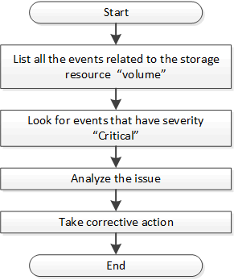

= Determining issues in storage objects using event APIs
:icons: font
:imagesdir: ../media/

[.lead]
When a storage object in your data center crosses a threshold, you get a notification about that event. Using this notification, you can analyze the issue and take corrective action by using the `events` APIs.

This workflow takes the example of a volume as the resource object. You can use the `events` APIs to retrieve the list of events related to a volume, analyze the critical issues for that volume, and then take corrective actions to rectify the issue.

Follow these steps to determine the issues in your volume before taking remedial steps.

.Steps

. Analyze the critical Active IQ Unified Manager events notifications for the volumes in your data center.
. Query all the events for the volumes by using the following parameters in the /management-server/events API:
 `"*resource_type": "volume*"`
 `"*severity": "critical*"`
+
[cols="3*",options="header"]
|===
| Category| HTTP verb| Path
a|
management-server
a|
GET
a|
/management-server/events
|===

. View the output and analyze the issues in the specific volumes.
. Perform the necessary actions by using the Unified Manager REST APIs or web UI to resolve the issues.
