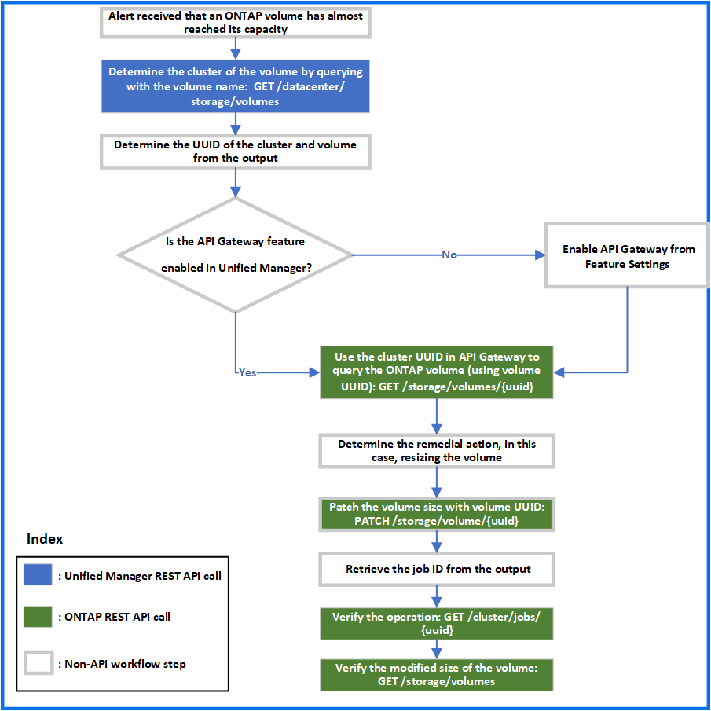

= Troubleshooting ONTAP volumes by using gateway APIs
:icons: font
:imagesdir: ../media/

[.lead]
The gateway APIs act as a gateway to invoke ONTAP APIs to query information about your ONTAP storage objects and take remedial measures to address the reported issues.

This workflow takes up a sample use case in which an event is raised when an ONTAP volume almost reaches its capacity. The workflow also demonstrates how to address this issue by invoking a combination of Active IQ Unified Manager and ONTAP REST APIs.

[NOTE]
====
Before running the workflow steps, ensure the following:

* You are aware of the gateway APIs and how they are used. For information, see link:concept_gateway_apis.html[Accessing ONTAP APIs through proxy access].
+
* You are aware of the usage of ONTAP REST APIs. For information about using ONTAP REST APIs, see
https://docs.netapp.com/us-en/ontap-automation/index.html[ONTAP Automation documentation].

* You are an Application Administrator.
* The cluster on which you want to run the REST API operations is supported by ONTAP 9.5 or later, and the cluster is added to Unified Manager over HTTPS.

====

The following diagram illustrates each step in the workflow for troubleshooting the issue of ONTAP volume capacity use.

The workflow covers the invocation points of both the Unified Manager and ONTAP REST APIs.

. Note the volume name from the event notifying the volume capacity utilization.
. By using the volume name as the value in the name parameter, query the volume by running the following Unified Manager API.
+
[cols="3*",options="header"]
|===
| Category| HTTP verb| Path
a|
datacenter
a|
GET
a|
`/datacenter/storage/volumes`
|===

. Retrieve the cluster UUID and volume UUID from the output.
. On the Unified Manager web UI, navigate to *General* > *Feature Settings* > *API Gateway* to verify whether the API Gateway feature is enabled. Unless it is enabled, the APIs under the gateway category are not available for you to invoke. Enable the feature if it is disabled.
. Use the cluster UUID to run the ONTAP API /`storage/volumes/\{uuid}` through API gateway. The query returns the volume details when the volume UUID is passed as the API parameter.
+
For running the ONTAP APIs through API gateway, the Unified Manager credentials are passed internally for authentication, and you do not need to run an additional authentication step for individual cluster access.
+
[cols="3*",options="header"]
|===
| Category| HTTP verb| Path
a|
Unified Manager: gateway

ONTAP: storage
a|
GET
a|
Gateway API: `/gateways/\{uuid}/\{path}`

ONTAP API: `/storage/volumes/\{uuid}`
|===
+
[NOTE]
====
In /gateways/\{uuid}/\{path}, the value for \{uuid} must be replaced with the cluster UUID on which the REST operation is to be performed. \{path} must be replaced by the ONTAP REST URL /storage/volumes/\{uuid}.
====
+
The appended URL is: `/gateways/\{cluster_uuid}/storage/volumes/\{volume_uuid}`
+
On running the GET operation, the generated URL is: `GEThttps://<hostname\>/api/gateways/<cluster_UUID\>/storage/volumes/\{volume_uuid\}`
+
*Sample cURL command*
+
----
curl -X GET "https://<hostname>/api/gateways/1cd8a442-86d1-11e0-ae1c-9876567890123/storage/volumes/028baa66-41bd-11e9-81d5-00a0986138f7"
-H "accept: application/hal+json" -H "Authorization: Basic <Base64EncodedCredentials>"
----

. From the output, determine the size, usage, and remedial measure to be taken. In this workflow, the remedial measure taken is resizing the volume.
. Use the cluster UUID and run the following ONTAP API through the API gateway to resize the volume. For information about the input parameters for the gateway and ONTAP APIs, see step 5.
+
[cols="3*",options="header"]
|===
| Category| HTTP verb| Path
a|
Unified Manager: gateway

ONTAP: storage
a|
PATCH
a|
Gateway API: `/gateways/\{uuid}/\{path}`

ONTAP API: `/storage/volumes/\{uuid}`

|===
+
[NOTE]
====
Along with the cluster UUID and volume UUID, you must enter a value for the size parameter for resizing the volume. Ensure to enter the value _in bytes_. For example, if you want to increase the size of a volume from 100 GB to 120 GB, enter the value for parameter size at the end of the query: `-d {\"size\": 128849018880}"`
====
+
*Sample cURL command*
+
----
curl -X PATCH "https://<hostname>/api/gateways/1cd8a442-86d1-11e0-ae1c-9876567890123/storage/volumes/028baa66-41bd-11e9-81d5-00a0986138f7" -H
    "accept: application/hal+json" -H "Authorization: Basic <Base64EncodedCredentials>" -d
    {\"size\": 128849018880}"
----
+
The JSON output returns a Job UUID.

. Verify whether the job ran successfully by using the Job UUID. Use the cluster UUID and Job UUID to run the following ONTAP API through the API gateway. For information about the input parameters for the gateway and ONTAP APIs, see step 5.
+
[cols="3*",options="header"]
|===
| Category| HTTP verb| Path
a|
Unified Manager: gateway

ONTAP: cluster
a|
GET
a|
Gateway API: `/gateways/\{uuid}/\{path}`

ONTAP API: `/cluster/jobs/\{uuid}`

|===
The HTTP codes returned are the same as the ONTAP REST API HTTP status codes.

. Run the following ONTAP API to query the details of the resized volume. For information about the input parameters for the gateway and ONTAP APIs, see step 5.
+
[cols="3*",options="header"]
|===
| Category| HTTP verb| Path
a|
Unified Manager: gateway

ONTAP: storage
a|
GET
a|
Gateway API: `/gateways/\{uuid}/\{path}`

ONTAP API: `/storage/volumes/\{uuid}`

|===
The output displays an increased volume size of 120 GB.
