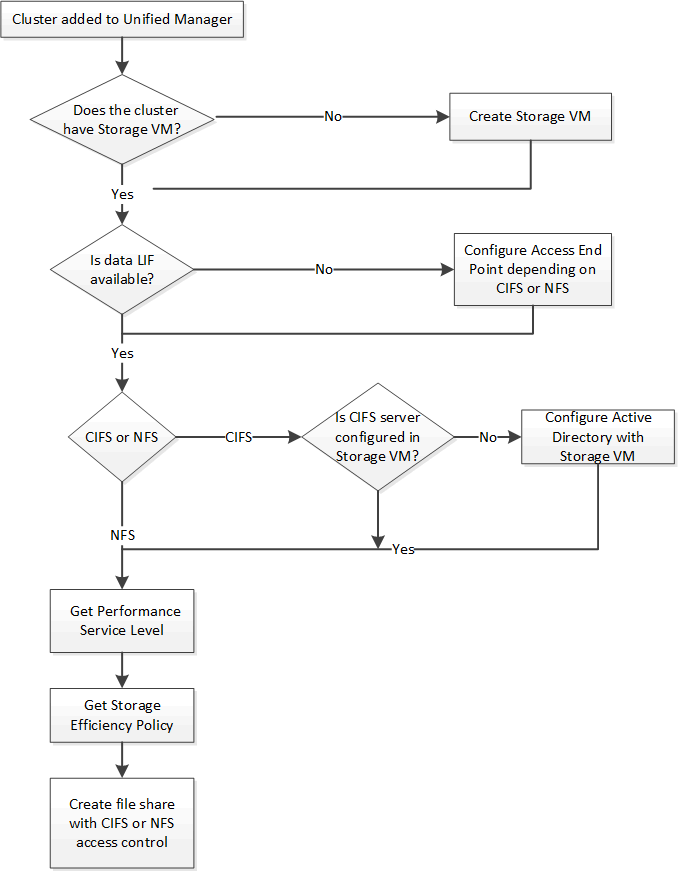

= Provisioning CIFS and NFS file shares by using APIs
:icons: font
:imagesdir: ../media/

[.lead]
You can provision CIFS shares and NFS file shares on your Storage Virtual Machines (SVMs) by using the provisioning APIs provided as a part of Active IQ Unified Manager. This provisioning workflow details the steps for retrieving the keys of the SVMs, Performance Service Levels, and Storage Efficiency Policies before creating the file shares.

The following diagram illustrates each step in a file share provisioning workflow. It includes provisioning both CIFS shares and NFS file shares.

[NOTE]
====
Ensure the following:

* ONTAP clusters have been added to Unified Manager, and the cluster key has been obtained.
* SVMs have been created on the clusters.
* The SVMs support CIFS and NFS services. Provisioning file shares might fail if the SVMs do not support the required services.
* The FCP port is online for port provisioning.

====

. Determine whether Data LIFs or access endpoints are available on the SVM on which you want to create the CIFS share. Get the list of available access endpoints on the SVM:
+
[cols="3*",options="header"]
|===
| Category| HTTP verb| Path
a|
storage-provider
a|
GET
a|
`/storage-provider/access-endpoints`
`/storage-provider/access-endpoints/\{key}`
|===
*Sample cURL*
+
----
curl -X GET "https://<hostname>/api/storage-provider/access-endpoints?resource.key=7d5a59b3-953a-11e8-8857-00a098dcc959" -H "accept: application/json" -H "Authorization: Basic <Base64EncodedCredentials>"
----

. If your access endpoint is available on the list, obtain the access endpoint key, else create the access endpoint.
+
[NOTE]
====
Ensure that you create access endpoints that have the CIFS protocol enabled on them. Provisioning CIFS shares fails unless you have created an access endpoint with the CIFS protocol enabled on it.
====
+
[cols="3*",options="header"]
|===
| Category| HTTP verb| Path
a|
storage-provider
a|
POST
a|
`/storage-provider/access-endpoints`
|===
*Sample cURL*
+
You must enter the details of the access endpoint that you want to create, as input parameters.
+
----
curl -X POST "https://<hostname>/api/storage-provider/access-endpoints" -H "accept: application/json" -H "Content-Type: application/json" -H "Authorization: Basic <Base64EncodedCredentials>"
{ \"data_protocols\": \"nfs\",
\"fileshare\": { \"key\": \"cbd1757b-0580-11e8-bd9d-00a098d39e12:type=volume,uuid=f3063d27-2c71-44e5-9a69-a3927c19c8fc\" },
\"gateway\": \"10.132.72.12\",
\"ip\": { \"address\": \"10.162.83.26\",
\"ha_address\": \"10.142.83.26\",
\"netmask\": \"255.255.0.0\" },
\"lun\": { \"key\": \"cbd1757b-0580-11e8-bd9d-00a098d39e12:type=lun,uuid=d208cc7d-80a3-4755-93d4-5db2c38f55a6\" },
\"mtu\": 15000, \"name\": \"aep1\",
\"svm\": { \"key\": \"cbd1757b-0580-11e8-bd9d-00a178d39e12:type=vserver,uuid=1d1c3198-fc57-11e8-99ca-00a098d38e12\" },
\"vlan\": 10}"
----
+
The JSON output displays a Job object key that you can use to verify the access endpoint that you created.

. Verify the access endpoint:
+
[cols="3*",options="header"]
|===
| Category| HTTP verb| Path
a|
management-server
a|
GET
a|
`/management-server/jobs/\{key}`
|===

. Determine whether you have to create a CIFS share or an NFS file share. For creating CIFS shares, follow these substeps:
 .. Determine whether the CIFS server is configured on your SVM, that is determine whether an Active Directory mapping is created on the SVM.
+
[cols="3*",options="header"]
|===
| Category| HTTP verb| Path
a|
storage-provider
a|
GET
a|
`/storage-provider/active-directories-mappings`
|===

 .. If the Active Directory mapping is created, take the key, else create the Active Directory mapping on the SVM.
+
[cols="3*",options="header"]
|===
| Category| HTTP verb| Path
a|
storage-provider
a|
POST
a|
`/storage-provider/active-directories-mappings`
|===
*Sample cURL*
+
You must enter the details for creating the Active Directory mapping, as the input parameters.
+
----
curl -X POST "https://<hostname>/api/storage-provider/active-directories-mappings" -H "accept: application/json" -H "Content-Type: application/json" -H "Authorization: Basic <Base64EncodedCredentials>"
{ \"_links\": {},
\"dns\": \"10.000.000.000\",
\"domain\": \"example.com\",
\"password\": \"string\",
\"svm\": { \"key\": \"9f4ddea-e395-11e9-b660-005056a71be9:type=vserver,uuid=191a554a-f0ce-11e9-b660-005056a71be9\" },
\"username\": \"string\"}"
----
+
This is a synchronous call and you can verify the creation of the Active Directory mapping in the output. In case of an error, the error message is displayed for you to troubleshoot and rerun the request.
. Obtain the SVM key for the SVM on which you want to create the CIFS share or the NFS file share, as described in the _Verifying SVMs on clusters_ workflow topic.
. Obtain the key for the Performance Service Level by running the following API and retrieving the key from the response.
+
[cols="3*",options="header"]
|===
| Category| HTTP verb| Path
a|
storage-provider
a|
GET
a|
`/storage-provider/performance-service-levels`
|===
+
[NOTE]
====
You can retrieve the details of the system-defined Performance Service Levels by setting the `system_defined` input parameter to `true`. From the output, obtain the key of the Performance Service Level that you want to apply on the file share.
====

. Optionally, obtain the Storage Efficiency Policy key for the Storage Efficiency Policy that you want to apply on the file share by running the following API and retrieving the key from the response.
+
[cols="3*",options="header"]
|===
| Category| HTTP verb| Path
a|
storage-provider
a|
GET
a|
`/storage-provider/storage-efficiency-policies`
|===

. Create the file share. You can create a file share that supports both CIFS and NFS by specifying the access control list and export policy. The following substeps provide information if you want to create a file share for supporting only one of the protocols on the volume. You can also update an NFS file share to include the access control list after you have created the NFS share. For information, see the _Modifying storage workloads_ topic.
 .. For creating only a CIFS share, gather the information about access control list (ACL). For creating the CIFS share, provide valid values for the following input parameters. For each user group that you assign, an ACL is created when a CIFS/SMB share is provisioned. Based on the values you enter for ACL and Active Directory mapping, the access control and mapping are determined for the CIFS share when it is created.
+
*A cURL command with sample values*
+
----
{
  "access_control": {
    "acl": [
      {
        "permission": "read",
        "user_or_group": "everyone"
      }
    ],
    "active_directory_mapping": {
      "key": "3b648c1b-d965-03b7-20da-61b791a6263c"
    },
----

 .. For creating only an NFS file share, gather the information about the export policy. For creating the NFS file share, provide valid values for the following input parameters. Based on your values, the export policy is attached with the NFS file share when it is created.
+
[NOTE]
====
While provisioning the NFS share, you can either create an export policy by providing all the required values or provide the export policy key and reuse an existing export policy. If you want to reuse an export policy for the storage VM, you need to add the export policy key. Unless you know the key, you can retrieve the export policy key by using the `/datacenter/protocols/nfs/export-policies` API. For creating a new policy, you must enter the rules as displayed in the following sample. For the entered rules, the API tries to search for an existing export policy by matching the host, storage VM, and rules. If there is an existing export policy, it is used. Otherwise a new export policy is created.
====
+
*A cURL command with sample values*
+
----
"export_policy": {
      "key": "7d5a59b3-953a-11e8-8857-00a098dcc959:type=export_policy,uuid=1460288880641",
      "name_tag": "ExportPolicyNameTag",
      "rules": [
        {
          "clients": [
            {
              "match": "0.0.0.0/0"
            }
----

+
After configuring access control list and export policy, provide the valid values for the mandatory input parameters for both CIFS and NFS file shares:

[NOTE]
====
Storage Efficiency Policy is an optional parameter for creating file shares.
====

[cols="3*",options="header"]
|===
| Category| HTTP verb| Path
a|
storage-provider
a|
POST
a|
`/storage-provider/file-shares`
|===
The JSON output displays a Job object key that you can use to verify the file share that you created.
. Verify the file share creation by using the Job object key returned in querying the job:

[cols="3*",options="header"]
|===
| Category| HTTP verb| Path
a|
management-server
a|
GET
a|
`/management-server/jobs/\{key}`
|===
At the end of the response, you see the key of the file share created.

----

    ],
    "job_results": [
        {
            "name": "fileshareKey",
            "value": "7d5a59b3-953a-11e8-8857-00a098dcc959:type=volume,uuid=e581c23a-1037-11ea-ac5a-00a098dcc6b6"
        }
    ],
    "_links": {
        "self": {
            "href": "/api/management-server/jobs/06a6148bf9e862df:-2611856e:16e8d47e722:-7f87"
        }
    }
}
----

. Verify the creation of the file share by running the following API with the returned key:
+
[cols="3*",options="header"]
|===
| Category| HTTP verb| Path
a|
storage-provider
a|
GET
a|
`/storage-provider/file-shares/\{key}`
|===
*Sample JSON output*
+
You can see that the POST method of `/storage-provider/file-shares` internally invokes all the APIs required for each of the functions and creates the object. For example, it invokes the `/storage-provider/performance-service-levels/` API for assigning the Performance Service Level on the file share.
+
----
{
    "key": "7d5a59b3-953a-11e8-8857-00a098dcc959:type=volume,uuid=e581c23a-1037-11ea-ac5a-00a098dcc6b6",
    "name": "FileShare_377",
    "cluster": {
        "uuid": "7d5a59b3-953a-11e8-8857-00a098dcc959",
        "key": "7d5a59b3-953a-11e8-8857-00a098dcc959:type=cluster,uuid=7d5a59b3-953a-11e8-8857-00a098dcc959",
        "name": "AFFA300-206-68-70-72-74",
        "_links": {
            "self": {
                "href": "/api/datacenter/cluster/clusters/7d5a59b3-953a-11e8-8857-00a098dcc959:type=cluster,uuid=7d5a59b3-953a-11e8-8857-00a098dcc959"
            }
        }
    },
    "svm": {
        "uuid": "b106d7b1-51e9-11e9-8857-00a098dcc959",
        "key": "7d5a59b3-953a-11e8-8857-00a098dcc959:type=vserver,uuid=b106d7b1-51e9-11e9-8857-00a098dcc959",
        "name": "RRT_ritu_vs1",
        "_links": {
            "self": {
                "href": "/api/datacenter/svm/svms/7d5a59b3-953a-11e8-8857-00a098dcc959:type=vserver,uuid=b106d7b1-51e9-11e9-8857-00a098dcc959"
            }
        }
    },
    "assigned_performance_service_level": {
        "key": "1251e51b-069f-11ea-980d-fa163e82bbf2",
        "name": "Value",
        "peak_iops": 75,
        "expected_iops": 75,
        "_links": {
            "self": {
                "href": "/api/storage-provider/performance-service-levels/1251e51b-069f-11ea-980d-fa163e82bbf2"
            }
        }
    },
    "recommended_performance_service_level": {
        "key": null,
        "name": "Idle",
        "peak_iops": null,
        "expected_iops": null,
        "_links": {}
    },
    "space": {
        "size": 104857600
    },
    "assigned_storage_efficiency_policy": {
        "key": null,
        "name": "Unassigned",
        "_links": {}
    },
    "access_control": {
        "acl": [
            {
                "user_or_group": "everyone",
                "permission": "read"
            }
        ],
        "export_policy": {
            "id": 1460288880641,
            "key": "7d5a59b3-953a-11e8-8857-00a098dcc959:type=export_policy,uuid=1460288880641",
            "name": "default",
            "rules": [
                {
                    "anonymous_user": "65534",
                    "clients": [
                        {
                            "match": "0.0.0.0/0"
                        }
                    ],
                    "index": 1,
                    "protocols": [
                        "nfs3",
                        "nfs4"
                    ],
                    "ro_rule": [
                        "sys"
                    ],
                    "rw_rule": [
                        "sys"
                    ],
                    "superuser": [
                        "none"
                    ]
                },
                {
                    "anonymous_user": "65534",
                    "clients": [
                        {
                            "match": "0.0.0.0/0"
                        }
                    ],
                    "index": 2,
                    "protocols": [
                        "cifs"
                    ],
                    "ro_rule": [
                        "ntlm"
                    ],
                    "rw_rule": [
                        "ntlm"
                    ],
                    "superuser": [
                        "none"
                    ]
                }
            ],
            "_links": {
                "self": {
                    "href": "/api/datacenter/protocols/nfs/export-policies/7d5a59b3-953a-11e8-8857-00a098dcc959:type=export_policy,uuid=1460288880641"
                }
            }
        }
    },
    "_links": {
        "self": {
            "href": "/api/storage-provider/file-shares/7d5a59b3-953a-11e8-8857-00a098dcc959:type=volume,uuid=e581c23a-1037-11ea-ac5a-00a098dcc6b6"
        }
    }
}
----
