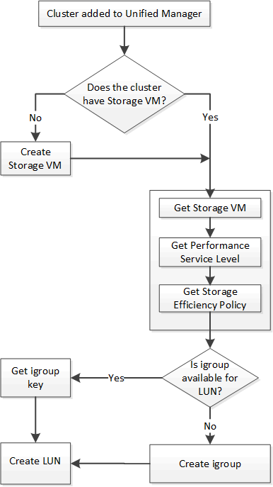

= Provisioning LUNs by using APIs
:icons: font
:imagesdir: ../media/

[.lead]
You can provision LUNs on your Storage Virtual Machines (SVMs) by using the provisioning APIs provided as a part of Active IQ Unified Manager. This provisioning workflow details the steps for retrieving the keys of the SVMs, Performance Service Levels, and Storage Efficiency Policies before creating the LUN.

The following diagram illustrates the steps in a LUN provisioning workflow.

[NOTE]
====
This workflow assumes that the ONTAP clusters have been added to Unified Manager, and the cluster key has been obtained. The workflow also assumes that the SVMs have already been created on the clusters.
====

. Obtain the SVM key for the SVM on which you want to create the LUN, as described in the _Verifying SVMs on clusters_ workflow topic.
. Obtain the key for the Performance Service Level by running the following API and retrieving the key from the response.
+
[cols="3*",options="header"]
|===
| Category| HTTP verb| Path
a|
storage-provider
a|
GET
a|
`/storage-provider/performance-service-levels`
|===
+
[NOTE]
====
You can retrieve the details of the system-defined Performance Service Levels by setting the `system_defined` input parameter to `true`. From the output, obtain the key of the Performance Service Level that you want to apply on the LUN.
====

. Optionally, obtain the Storage Efficiency Policy key for the Storage Efficiency Policy that you want to apply on the LUN by running the following API and retrieving the key from the response.
+
[cols="3*",options="header"]
|===
| Category| HTTP verb| Path
a|
storage-provider
a|
GET
a|
`/storage-provider/storage-efficiency-policies`
|===

. Determine if initiator groups (igroups) have been created to grant access to the LUN target that you want to create.
+
[cols="3*",options="header"]
|===
| Category| HTTP verb| Path
a|
datacenter
a|
GET
a|
`/datacenter/protocols/san/igroups`     `/datacenter/protocols/san/igroups/\{key}`
|===
You must enter the parameter value for indicating the SVM for which the igroup has authorized access. Additionally, if you want to query a particular igroup, enter the igroup name (key) as an input parameter.

. In the output, if you can find the igroup that you want to grant access to, obtain the key. Otherwise create the igroup.
+
[cols="3*",options="header"]
|===
| Category| HTTP verb| Path
a|
datacenter
a|
POST
a|
`/datacenter/protocols/san/igroups`
|===
You must enter the details of the igroup that you want to create, as the input parameters. This is a synchronous call and you can verify the igroup creation in the output. In case of an error, a message is displayed for you to troubleshoot and rerun the API.

. Create the LUN.
+
[cols="3*",options="header"]
|===
| Category| HTTP verb| Path
a|
storage-provider
a|
POST
a|
`/storage-provider/luns`
|===
For creating the LUN, ensure that you have added the retrieved values as mandatory input parameters.
+
[NOTE]
====
Storage Efficiency Policy is an optional parameter for creating LUNs.
====
+
*Sample cURL*
+
You must enter all the details of the LUN that you want to create, as the input parameters.
+
The JSON output displays a Job object key that you can use to verify the LUN that you created.

. Verify the LUN creation by using the Job object key returned in querying the Job:
+
[cols="3*",options="header"]
|===
| Category| HTTP verb| Path
a|
management-server
a|
GET
a|
`/management-server/jobs/\{key}`
|===
At the end of the response, you see the key of the LUN created.
+
. Verify the creation of the LUN by running the following API with the returned key:
+
[cols="3*",options="header"]
|===
| Category| HTTP verb| Path
a|
storage-provider
a|
GET
a|
`/storage-provider/luns/\{key}`
|===
*Sample JSON output*
+
You can see that the POST method of `/storage-provider/luns` internally invokes all the APIs required for each of the functions and creates the object. For example, it invokes the `/storage-provider/performance-service-levels/` API for assigning the Performance Service Level on the LUN.
+

== Troubleshooting steps for failure in LUN creation or mapping

On completing this workflow, you might still see a failure in your LUN creation. Even if the LUN is created successfully, the LUN mapping with the igroup might fail due to an unavailability of a SAN LIF or access endpoint on the node on which you create the LUN. In case of a failure, you can see the following message:

----
The nodes <node_name> and <partner_node_name> have no LIFs configured with the iSCSI or FCP protocol for Vserver <server_name>. Use the access-endpoints API to create a LIF for the LUN.
----

Follow these troubleshooting steps to work around this failure.

. Create an access endpoint supporting ISCSI/FCP protocol on the SVM on which you tried creating the LUN.
+
[cols="3*",options="header"]
|===
| Category| HTTP verb| Path
a|
storage-provider
a|
POST
a|
`/storage-provider/access-endpoints`
|===
*Sample cURL*
+
You must enter the details of the access endpoint that you want to create, as the input parameters.
+
[NOTE]
====
Ensure that in the input parameter you have added the address to indicate the home node of the LUN and the ha_address to indicate the partner node of the home node. When you run this operation, it creates access endpoints on both the home node and the partner node.
====
+
. Query the job with the Job object key returned in the JSON output to verify that it has run successfully to add the access endpoints on the SVM and that the iSCSI/FCP services have been enabled on the SVM.
+
[cols="3*",options="header"]
|===
| Category| HTTP verb| Path
a|
management-server
a|
GET
a|
`/management-server/jobs/\{key}`
|===
*Sample JSON output*
+
At the end of the output, you can see the key of the access endpoints created. In the following output, the "name": "accessEndpointKey" value indicates the access endpoint created on the home node of the LUN, for which the key is 9c964258-14ef-11ea-95e2-00a098e32c28. The "name": "accessEndpointHAKey" value indicates the access endpoint created on the partner node of the home node, for which the key is 9d347006-14ef-11ea-8760-00a098e3215f.
+

. Modify the LUN to update the igroup mapping. For more information about workflow modification, see "`Modifying storage workloads`".
+
[cols="3*",options="header"]
|===
| Category| HTTP verb| Path
a|
storage-provider
a|
PATCH
a|
`/storage-provider/lun/\{key}`
|===
In the input, specify the igroup key with which you want to update the LUN mapping, along with the LUN key.
+
*Sample cURL*
+
The JSON output displays a Job object key that you can use to verify whether the mapping is successful.

. Verify the LUN mapping by querying with the LUN key.
+
[cols="3*",options="header"]
|===
| Category| HTTP verb| Path
a|
storage-provider
a|
GET
a|
`/storage-provider/luns/\{key}`
|===
*Sample JSON output*
+
In the output you can see the LUN has been successfully mapped with the igroup (key d19ec2fa-fec7-11e8-b23d-00a098e32c28) with which it was initially provisioned.
