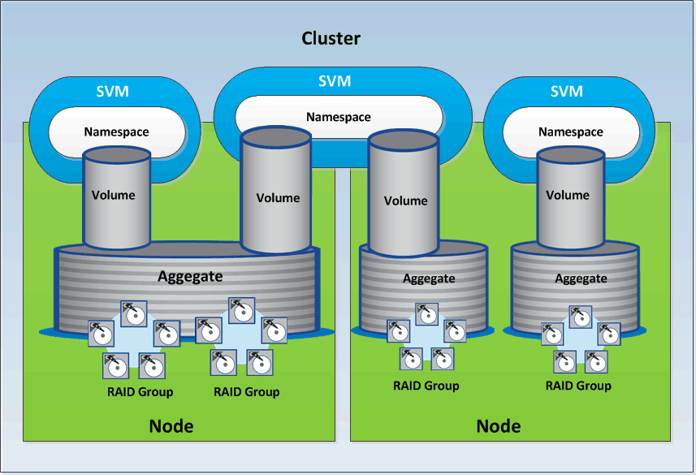

= Storage resources in ONTAP
:icons: font
:imagesdir: ../media/

[.lead]
The storage resources in ONTAP can be broadly classified into _physical storage resources_ and _logical storage resources._ To effectively manage your ONTAP systems using the APIs provided in Active IQ Unified Manager, you must understand the storage resource model and the relationship between various storage resources.

* *Physical storage resources*
+
Refers to the physical storage objects provided by ONTAP. Physical storage resources include disks, clusters, storage controllers, nodes, and aggregates.

* *Logical storage resources*
+
Refers to the storage resources provided by ONTAP that are not tied to a physical resource. These resources are associated with a storage virtual machine (SVM, formerly known as Vserver), and they exist independently of any specific physical storage resource such as a disk, array LUN, or aggregate.
+
Logical storage resources include volumes of all types and qtrees, as well as the capabilities and configurations you can use with these resources, such as Snapshot copies, deduplication, compression, and quotas.

The following illustration shows the storage resources in a 2-node cluster:

