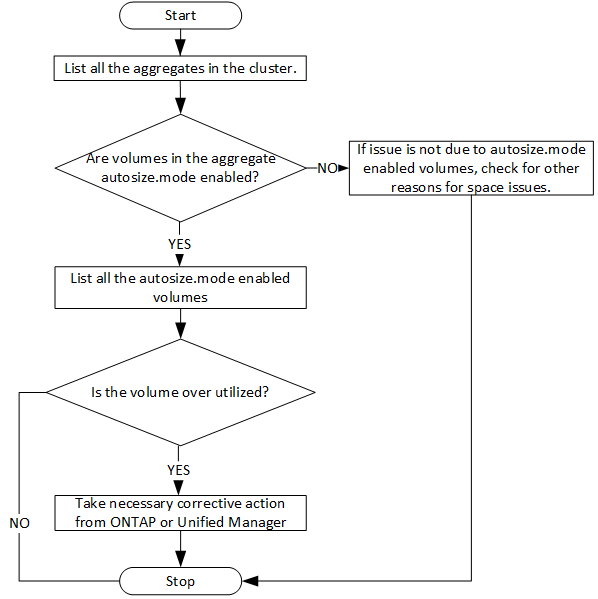

= Determining space issues in aggregates by using APIs
:icons: font
:imagesdir: ../media/

[.lead]
You can use the data center APIs in Active IQ Unified Manager to monitor the availability and utilization of space in your volumes. You can determine space issues in your volume and identify storage resources that are overutilized or underutilized.

The data center APIs for aggregates retrieve the relevant information about available and used space, and space saving efficiency settings. You can also filter the retrieved information based on specified attributes.

One method to determine any lack of space in your aggregates is to verify whether there are volumes in your environment with autosize-mode enabled. You should then identify which volumes are being over-utilized and perform any corrective actions.

The following flowchart illustrates the process of retrieving information about volumes with autosize-mode enabled:

This flow assumes that the clusters have already been created in ONTAP and added to Unified Manager.

. Obtain the cluster key, unless you know the value:
+
[cols="3*",options="header"]
|===
| Category| HTTP verb| Path
a|
datacenter
a|
GET
a|
`/datacenter/cluster/clusters`
|===

. Using the cluster key as the filter parameter, query the aggregates on that cluster.
+
[cols="3*",options="header"]
|===
| Category| HTTP verb| Path
a|
datacenter
a|
GET
a|
`/datacenter/storage/aggregates`
|===

. From the response, analyze the space usage of the aggregates and determine which aggregates have space issues. For each aggregate with space issue, obtain the aggregate key from the same JSON output.
. Using each aggregate key, filter all the volumes that have the value for the autosize.mode parameter as `grow.`
+
[cols="3*",options="header"]
|===
| Category| HTTP verb| Path
a|
datacenter
a|
GET
a|
`/datacenter/storage/volumes`
|===

. Analyze which volumes are being over-utilized.
. Perform any necessary corrective action, such as moving the volume across aggregates, to address the space issues in your volume. You can perform these actions from ONTAP or Unified Manager web UI.
