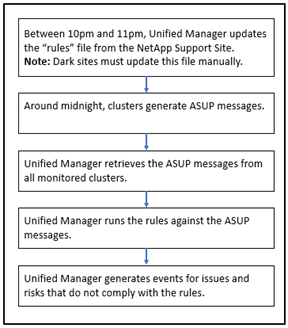

= How Active IQ platform events are generated
:icons: font
:imagesdir: ../media/

[.lead]
Active IQ platform incidents and risks are converted to Unified Manager events as shown in the following diagram.

As you can see, the rules file that is compiled on the Active IQ platform is kept current, cluster AutoSupport messages are generated daily, and Unified Manager updates the list of events on a daily basis.
