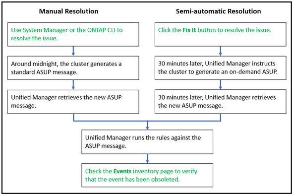

= Resolving Active IQ platform events
:icons: font
:imagesdir: ../media/

[.lead]
Active IQ platform incidents and risks are similar to other Unified Manager events because they can be assigned to other users for resolution and they have the same available states. However, when you resolve these types of events using the *Fix It* button you can verify the resolution within hours.

The following diagram shows the actions you must take (in green) and the action that Unified Manager takes (in black) when resolving events that were generated from the Active IQ platform.

When performing a manual resolution you must log into System Manager or the ONTAP command-line interface to fix the issue. You will be able to verify the issue only after the cluster generates a new AutoSupport message at midnight.

When performing a semi-automatic resolution using the *Fix It* button you are able to verify that the fix was successful within hours.
