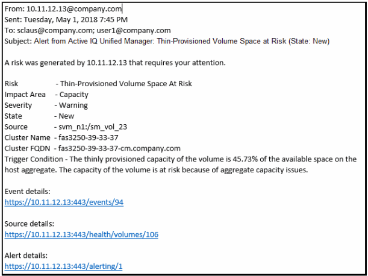

= What information is contained in an alert email
:icons: font
:imagesdir: ../media/

[.lead]
Unified Manager alert emails provide the type of event, the severity of the event, the name of the policy or threshold that was breached to cause the event, and a description of the event. The email message also provides a hyperlink for each event that enables you to view the details page for the event in the UI.

Alert emails are sent to all users who have subscribed to receive alerts.

If a performance counter or capacity value has a large change during a collection period, it could cause both a critical and a warning event to be triggered at the same time for the same threshold policy. In this case, you may receive one email for the warning event and one for the critical event. This is because Unified Manager enables you to subscribe separately to receive alerts for warning and critical threshold breaches.

A sample alert email is shown below:

