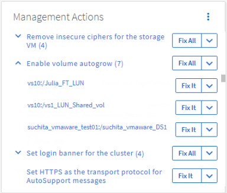

= Fixing issues using Unified Manager automatic remediation
:icons: font
:imagesdir: ../media/

[.lead]
There are certain events that Unified Manager can diagnose thoroughly and provide a single resolution using the *Fix It* button. When available, those resolutions are displayed in the Dashboard, from the Event details page, and from the Workload Analysis selection on the left-navigation menu.

Most events have a variety of possible resolutions that are displayed in the Event details page so you can implement the best solution using ONTAP System Manager or the ONTAP CLI. A *Fix It* action is available when Unified Manager has determined that there is a single resolution to fix the issue, and that it can be resolved using an ONTAP CLI command.

.Steps
. To view events that can be fixed from the *Dashboard*, click *Dashboard*.
+

. To resolve any of the issues that Unified Manager can fix, click the *Fix It* button. To fix an issue that exists on multiple objects, click the *Fix All* button.

For information about the issues that can be fixed by automatic remediation, see link:..//storage-mgmt/reference_what_ontap_issues_can_unified_manager_fix.html[What issues can Unified Manager fix].
