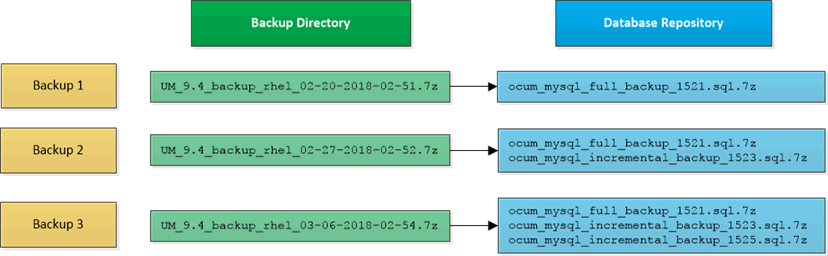

= Backup and restore using a MySQL database dump
:icons: font
:imagesdir: ../media/

[.lead]
A MySQL database dump backup is a copy of the Active IQ Unified Manager database and configuration files that you can use in case of a system failure or data loss. You can schedule a backup to be written to a local destination or to a remote destination. It is highly recommended that you define a remote location that is external to the Active IQ Unified Manager host system.

[NOTE]
====
MySQL database dump is the default backup mechanism when Unified Manager is installed on a Linux and Windows server. However, if Unified Manager is managing a large number of cluster and nodes, or if your MySQL backups are taking many hours to complete, you can back up using Snapshot copies. This functionality is available on Red Hat Enterprise Linux, CentOS Linux systems, and Windows.
====

A database dump backup consists of a single file in the backup directory and one or more files in the database repository directory. The file in the backup directory is very small because it contains only a pointer to the files located in the database repository directory that are required to recreate the backup.

The first time you generate a database backup a single file is created in the backup directory and a full backup file is created in the database repository directory. The next time you generate a backup a single file is created in the backup directory and an incremental backup file is created in the database repository directory that contains the differences from the full backup file. This process continues as you create additional backups, up to the maximum retention setting, as shown in the following figure.

[NOTE]
====
Do not rename or remove any of the backup files in these two directories or any subsequent restore operation will fail.
====

If you write your backup files to the local system, you should initiate a process to copy the backup files to a remote location so they will be available in case you have a system issue that requires a complete restore.

Before beginning a backup operation, Active IQ Unified Manager performs an integrity check to verify that all the required backup files and backup directories exist and are writable. It also checks that there is enough space on the system to create the backup file.
