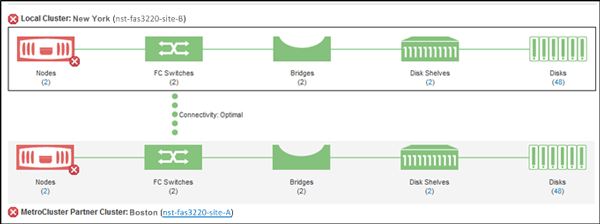
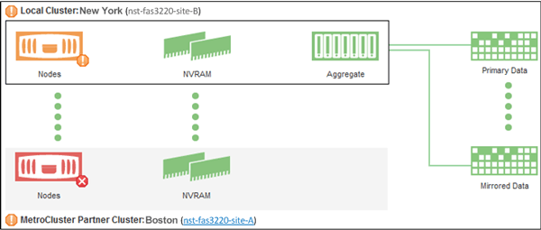

= Checking the health of clusters in a MetroCluster configuration
:icons: font
:imagesdir: ../media/

[.lead]
You can use Active IQ Unified Manager (Unified Manager) to check the operational health of clusters, and their components, in MetroCluster over FC and MetroCluster over IP configurations. If the clusters were involved in a performance event detected by Unified Manager, the health status can help you determine whether a hardware or software issue contributed to the event.

*What you'll need*

* You must have the Operator, Application Administrator, or Storage Administrator role.
* You must have analyzed a performance event for a MetroCluster configuration and obtained the name of the cluster involved.
* Both clusters in the MetroCluster configuration over FC and IP must be monitored by the same instance of Unified Manager.

== Determining cluster health in MetroCluster over FC configuration

Follow these steps for determining cluster health in a MetroCluster over FC configuration.

.Steps
. In the left navigation pane, click *Event Management* to display the event list.
. In the filter panel, select all MetroCluster filters under the *Source Type* category. You see all events raised in your environment for all MetroCluster configurations.
. Next to a MetroCluster event, click the name of the cluster.
+
[NOTE]
====
If no MetroCluster events are displayed, you can use the Search bar to search for the name of the cluster involved in the event related to you MetroCluster over FC configuration.
====
+
The Health: All Clusters view is displayed with detailed information about the event.
. Select the *MetroCluster Connectivity* tab to display the health of the connection between the selected cluster and its partner cluster.
+

+
In this example, the names and the components of the local cluster and its partner cluster are displayed. A yellow or red icon indicates a health event for the highlighted component. The Connectivity icon represents the link between the clusters. You can point your mouse cursor to an icon to display event information or click the icon to display the events. A health issue on either cluster might have contributed to the performance event.
+
Unified Manager monitors the NVRAM component of the link between the clusters. If the FC Switches icon on the local or partner cluster or the Connectivity icon is red, a link health issue might have caused the performance event.

. Select the *MetroCluster Replication* tab.
+

+
In this example, if the NVRAM icon on the local or partner cluster is yellow or red, a health issue with the NVRAM might have caused the performance event. If there are no red or yellow icons on the page, a performance issue on the partner cluster might have caused the performance event.

== Determining cluster health in MetroCluster over IP configuration

Follow these steps for determining cluster health in a MetroCluster over IP configuration.

.Steps
. In the left navigation pane, click *Event Management* to display the event list.
. In the filter panel, under the *Source Type* category, select the `MetroCluster Relationship` filter. You see all events raised in your environment for all MetroCluster configurations.
+
[NOTE]
====
If you cannot see the reported MetroCluster events, you can use the Search bar to search by the name of the cluster involved in the event related to you MetroCluster over IP configuration.
====
+
. Next to the relevant MetroCluster event, click the name of the cluster. The Clusters page is displayed with the details of that cluster. 
For information about determining health issues, see link:../storage-mgmt/task_monitor_metrocluster_configurations.html[Monitor connectivity issues in MetroCluster over IP configuration].