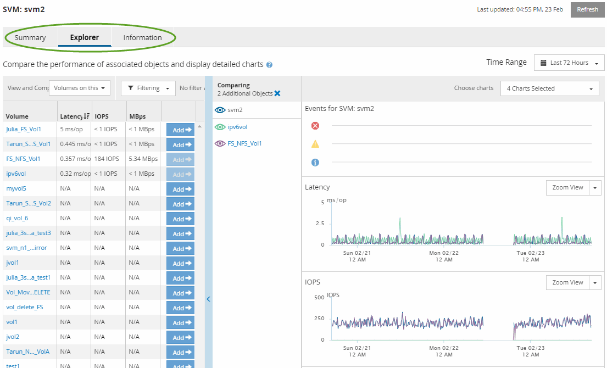

= Components of the Object Landing pages
:icons: font
:imagesdir: ../media/

[.lead]
The Object Landing pages provide details about all critical, warning, and informational events. They provide a detailed view into the performance of all cluster objects, enabling you to select and compare individual objects across various time periods.

The Object Landing pages enable you to examine the overall performance of all objects, and to compare object performance data in a side-by-side format. This is beneficial when assessing performance and when troubleshooting events.

[NOTE]
====
The data displayed in the counter summary panels and in the Counter Charts are based on a five-minute sampling interval. The data displayed in the objects inventory grid in the left side of the page is based on a one-hour sampling interval.
====

The following image shows an example of an Object Landing page displaying the Explorer information:

Depending on the storage object that is being viewed, the Object Landing page can have the following tabs that provide performance data about the object:

* Summary
+
Displays three or four counter charts containing the events and performance per object for the preceding 72-hour period, including a trend line that shows the high and low values during that period.

* Explorer
+
Displays a grid of storage objects that are related to the current object, which enables you to compare the performance values of the current object with those of the related objects. This tab includes up to eleven counter charts and a time range selector, which enable you to perform a variety of comparisons.

* Information
+
Displays values for non-performance configuration attributes about the storage object, including the installed version of ONTAP software, HA partner name, and number of ports and LIFs.

* Top Performers
+
For clusters: Displays the storage objects that have the highest performance or the lowest performance, based on the performance counter that you select.

* Failover Planning
+
For nodes: Displays the estimate of the performance impact on a node if the HA partner of the node fails.

* Details
+
For volumes: Displays detailed performance statistics for all I/O activity and operations for the selected volume workload. This tab is available for FlexVol volumes, FlexGroup volumes, and constituents of FlexGroups.

*Related information*

xref:task_viewing_event_details_in_the_performance_explorer_events_timeline.adoc[Viewing event details in the Events Timeline]

xref:concept_sources_of_performance_events.adoc[Sources of performance events]

xref:reference_summary_page_opm.adoc[Summary page]

xref:reference_cluster_summary_page_opm.adoc[Performance Cluster Summary page]

xref:concept_components_of_the_performance_explorer_page.adoc[Components of the Performance Explorer page]

xref:reference_top_performers_page.adoc[Top Performers page]

xref:reference_understanding_and_using_the_node_failover_planning_page.adoc[Understanding and using the Node Failover Planning page]
