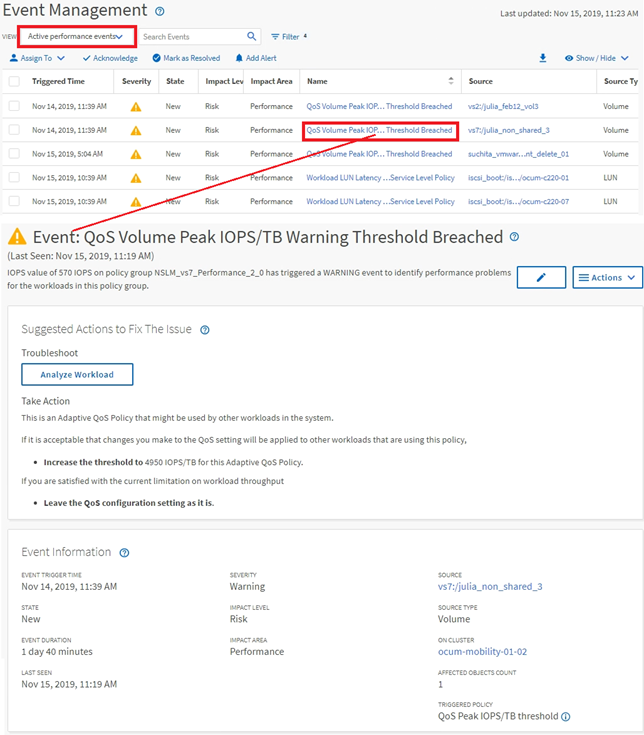

= Event investigation navigation
:icons: font
:imagesdir: ../media/

[.lead]
The Unified Manager event detail pages provide you with an in-depth look at any performance event. This is beneficial when investigating performance events, when troubleshooting, and when fine-tuning system performance.

Depending on the type of performance event, you might see one of two types of event detail pages:

* Event details page for user-defined and system-defined threshold policy events
* Event details page for dynamic threshold policy events

This is one example of an event investigation navigation.

. In the left navigation pane, click *Event Management*.
. From the View menu, click *Active performance events*.
. Click the name of the event that you want to investigate and the Event details page is displayed.
. View the Description of the event and review the Suggested Actions (where available) to view more details about the event that may help you resolve the issue. You can click the *Analyze Workload* button to display detailed performance charts to help further analyze the issue.

