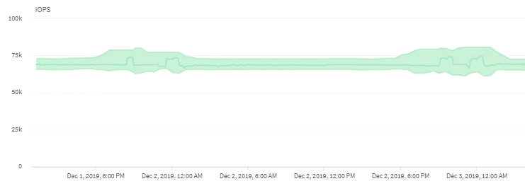

= How cluster operations can affect workload latency
:icons: font
:imagesdir: ../media/

[.lead]
Operations (IOPS) represent the activity of all user-defined and system-defined workloads on a cluster. The IOPS statistics help you determine whether cluster processes, such as making backups or running deduplication, are impacting workload latency (response time) or might have caused, or contributed to, a performance event.

When analyzing performance events, you can use the IOPS statistics to determine whether a performance event was caused by an issue on the cluster. You can identify the specific workload activities that might have been the main contributors to the performance event. IOPS are measured in operations per second (ops/sec).

This example shows the IOPS chart. The actual operations statistics is a blue line and the IOPS forecast of operations statistics is green.

[NOTE]
====
In some cases where a cluster is overloaded, Unified Manager might display the message Data collection is taking too long on Cluster cluster_name. This means that not enough statistics have been collected for Unified Manager to analyze. You need to reduce the resources the cluster is using so that statistics can be collected.
====

*Related information*

xref:concept_what_expected_range_of_performance_is.adoc[What the expected range of performance is]

xref:concept_how_unified_manager_uses_workload_response_time.adoc[How Unified Manager uses workload latency to identify performance issues]
