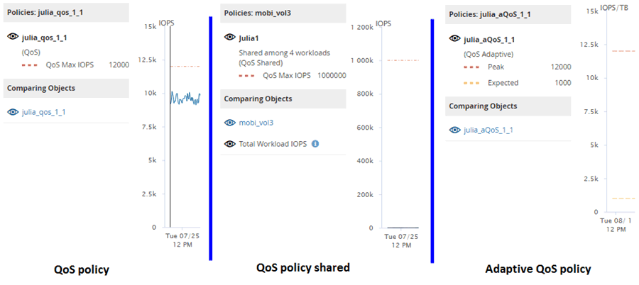

= How different types of QoS policies are displayed in the throughput charts
:icons: font
:imagesdir: ../media/

[.lead]
You can view the ONTAP-defined quality of service (QoS) policy settings that have been applied to a volume or LUN in the Performance Explorer and Workload Analysis IOPS, IOPS/TB, and MB/s charts. The information displayed in the charts is different depending on the type of QoS policy that has been applied to the workload.

A throughput maximum (or "`peak`") setting defines the maximum throughput that the workload can consume, and thereby limits the impact on competing workloads for system resources. A throughput minimum (or "`expected`") setting defines the minimum throughput that must be available to the workload so that a critical workload meets minimum throughput targets regardless of demand by competing workloads.

Shared and non-shared QoS policies for IOPS and MB/s use the terms "`minimum`" and "`maximum`" to define the floor and ceiling. Adaptive QoS policies for IOPS/TB, which were introduced in ONTAP 9.3, use the terms "`expected`" and "`peak`" to define the floor and ceiling.

While ONTAP enables you to create these two types of QoS policies, depending on how they are applied to workloads there are three ways that the QoS policy will be displayed in the performance charts.
[options="header"]
|===
| Type of policy| Functionality| Indicator in Unified Manager interface
a|
QoS shared policy assigned to a single workload, or QoS non-shared policy assigned to a single workload or multiple workloads
a|
Each workload can consume the specified throughput setting
a|
Displays "`(QoS)`"
a|
QoS shared policy assigned to multiple workloads
a|
All workloads share the specified throughput setting
a|
Displays "`(QoS Shared)`"
a|
Adaptive QoS policy assigned to a single workload or multiple workloads
a|
Each workload can consume the specified throughput setting
a|
Displays "`(QoS Adaptive)`"
|===
The following figure shows an example of how the three options are shown in the counter charts.

When a normal QoS policy that has been defined in IOPS appears in the IOPS/TB chart for a workload, ONTAP converts the IOPS value to an IOPS/TB value and Unified Manager displays that policy in the IOPS/TB chart along with the text "`QoS, defined in IOPS`".

When an adaptive QoS policy that has been defined in IOPS/TB appears in the IOPS chart for a workload, ONTAP converts the IOPS/TB value to an IOPS value and Unified Manager displays that policy in the IOPS chart along with the text "`QoS Adaptive - Used, defined in IOPS/TB`" or "`QoS Adaptive - Allocated, defined in IOPS/TB`" depending on how the peak IOPS allocation setting is configured. When the allocation setting is set to "`allocated-space`", the peak IOPS is calculated based on the size of the volume. When the allocation setting is set to "`used-space`", the peak IOPS is calculated based on the amount of data stored in the volume, taking into account storage efficiencies.

[NOTE]
====
The IOPS/TB chart displays performance data only when the logical capacity used by the volume is greater than or equal to 128 GB. Gaps are displayed in the chart when the used capacity falls below 128 GB during the selected timeframe.
====
