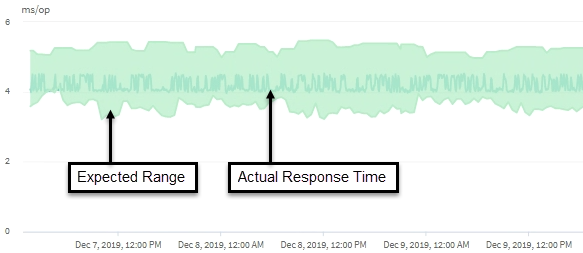

= How Unified Manager uses workload latency to identify performance issues
:icons: font
:imagesdir: ../media/

[.lead]
The workload latency (response time) is the time it takes for a volume on a cluster to respond to I/O requests from client applications. Unified Manager uses the latency to detect and alert you to performance events.

A high latency means that requests from applications to a volume on a cluster are taking longer than usual. The cause of the high latency could be on the cluster itself, due to contention on one or more cluster components. High latency could also be caused by issues outside of the cluster, such as network bottlenecks, issues with the client hosting the applications, or issues with the applications themselves.

[NOTE]
====
Unified Manager only monitors the workload activity on the cluster. It does not monitor the applications, the clients, or the paths between the applications and the cluster.
====

Operations on the cluster, such as making backups or running deduplication, that increase their demand of cluster components shared by other workloads can also contribute to high latency. If the actual latency exceeds the dynamic performance threshold of the expected range (latency forecast), Unified Manager analyzes the event to determine whether it is a performance event that you might need to resolve. The latency is measured in milliseconds per operation (ms/op).

On the Latency Total chart in the Workload Analysis page, you can view an analysis of the latency statistics to see how the activity of individual processes, such as read and write requests, compares to the overall latency statistics. The comparison helps you determine which operations have the highest activity or whether specific operations have abnormal activity that is impacting the latency for a volume. When analyzing performance events, you can use the latency statistics to determine whether an event was caused by an issue on the cluster. You can also identify the specific workload activities or cluster components that are involved in the event.

This example shows the Latency chart . The actual response time (latency) activity is a blue line and the latency forecast (expected range) is green.

[NOTE]
====
There can be gaps in the blue line if Unified Manager was unable to gather data. This can occur because the cluster or volume was unreachable, Unified Manager was turned off during that time, or the collection was taking longer than the 5 minute collection period.
====
