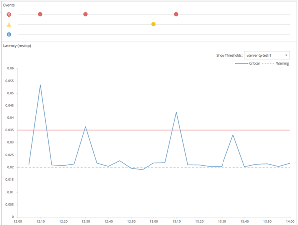

= How user-defined performance threshold policies work
:icons: font
:imagesdir: ../media/

[.lead]
You set performance threshold policies on storage objects (for example, on aggregates and volumes) so that an event can be sent to the storage administrator to inform the administrator that the cluster is experiencing a performance issue.

You create a performance threshold policy for a storage object by:

* Selecting a storage object
* Selecting a performance counter associated with that object
* Specifying values that define the performance counter upper limits that are considered warning and critical situations
* Specifying a time period that defines how long the counter must exceed the upper limit

For example, you can set a performance threshold policy on a volume so that you receive a critical event notification whenever IOPS for that volume exceeds 750 operations per second for 10 consecutive minutes. This same threshold policy can also specify that a warning event be sent when IOPS exceeds 500 operations per second for 10 minutes.

[NOTE]
====
The current release provides thresholds that send events when a counter value exceeds the threshold setting. You cannot set thresholds that send events when a counter value falls below a threshold setting.
====

An example counter chart is shown here, indicating that a warning threshold (yellow icon) was breached at 1:00, and that a critical threshold (red icon) was breached at 12:10, 12:30, and 1:10:

A threshold breach must occur continuously for the specified duration. If the threshold dips below the limit values for any reason, a subsequent breach is considered the start of a new duration.

Some cluster objects and performance counters enable you to create a combination threshold policy that requires two performance counters to exceed their maximum limits before an event is generated. For example, you can create a threshold policy using the following criteria:

|===
| Cluster object| Performance counter| Warning threshold| Critical threshold| Duration
a|
Volume
a|
Latency
a|
10 milliseconds
a|
20 milliseconds
a|
15 minutes
a|
Aggregate
a|
Utilization
a|
65%
a|
85%
|===
Threshold policies that use two cluster objects cause an event to be generated only when both conditions are breached. For example, using the threshold policy defined in the table:

|===
| If volume latency is averaging...| And aggregate disk utilization is...| Then...
a|
15 milliseconds
a|
50%
a|
No event is reported.
a|
15 milliseconds
a|
75%
a|
A Warning event is reported.
a|
25 milliseconds
a|
75%
a|
A Warning event is reported.
a|
25 milliseconds
a|
90%
a|
A Critical event is reported.
|===
*Related information*

xref:reference_what_performance_metrics_can_be_monitored_using_thresholds.adoc[What performance counters can be tracked using thresholds]

xref:reference_what_objects_and_metrics_can_be_used_in_combination_threshold_policies.adoc[What objects and counters can be used in combination threshold policies]
