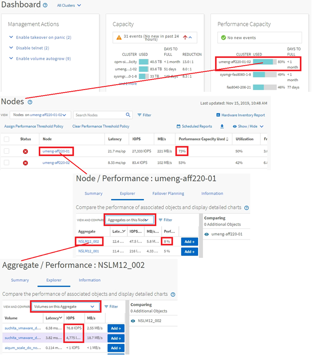

= Monitor cluster object navigation
:icons: font
:imagesdir: ../media/

[.lead]
You can monitor the performance of all objects in any cluster managed by Unified Manager. Monitoring your storage objects provides you with an overview of cluster and object performance, and includes performance event monitoring. You can view performance and events at a high level, or you can further investigate any details of object performance and performance events.

This is one example of many possible cluster object navigations:

. From the Dashboard page, review the details in the Performance Capacity panel to identify the cluster that is using the most performance capacity and click the bar chart to navigate to the list of nodes for that cluster.
. Identify the node with the highest performance capacity used value and click that node.
. From the Node / Performance Explorer page, click *Aggregates on this Node* from the View and Compare menu.
. Identify the aggregate that is using the most performance capacity and click that aggregate.
. From the Aggregate / Performance Explorer page, click *Volumes on this Aggregate* from the View and Compare menu.
. Identify the volumes that are using the most IOPS.

You should investigate these volumes to see if you should apply a QoS policy or Performance Service Level policy, or change the policy settings, so that those volumes do not use such a large percentage of IOPS on the cluster.

