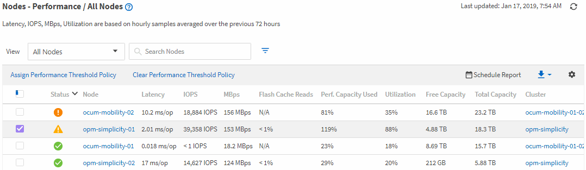

= Monitoring performance using the Performance Inventory pages
:icons: font
:imagesdir: ../media/

[.lead]
The object inventory performance pages display performance information, performance events, and object health for all objects within an object type category. This provides you with an at-a-glance overview of the performance status of each object within a cluster, for example, for all nodes or all volumes.

Object inventory performance pages provide a high-level overview of object status, enabling you to assess the overall performance of all objects and compare object performance data. You can refine the content of object inventory pages by searching, sorting, and filtering. This is beneficial when monitoring and managing object performance, because it enables you to quickly locate objects with performance issues and to begin the troubleshooting process.

By default, objects on the performance inventory pages are sorted based on object performance criticality. Objects with new critical performance events are listed first, and objects with warning events are listed second. This provides an immediate visual indication of issues that must be addressed. All performance data is based on a 72-hour average.

You can easily navigate from the object inventory performance page to an object details page by clicking the object name in the object name column. For example, on the Performance/All Nodes inventory page, you would click a node object in the *Nodes* column. The object details page provides in-depth information and detail about the selected object, including side-by-side comparison of active events.
