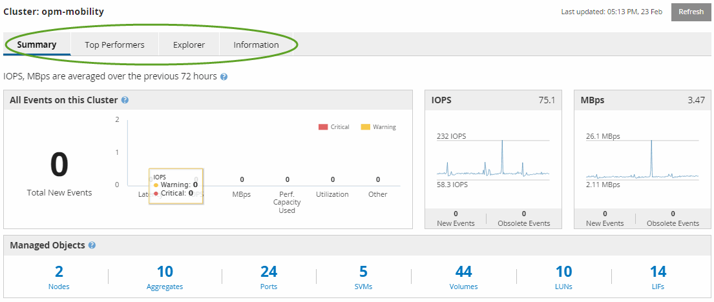

= Understanding the Performance Cluster Landing page
:icons: font
:imagesdir: ../media/

[.lead]
The Performance Cluster Landing page provides a high-level performance overview of a selected cluster, with an emphasis on the performance status of the top 10 objects within the cluster. Performance issues are displayed at the top of the page, in the All Events on this Cluster panel.

The Performance Cluster Landing page provides a high-level overview of each cluster that is managed by an instance of Unified Manager. This page provides you with information about events and performance, and enables you to monitor and troubleshoot clusters. The following image shows an example of the Performance Cluster Landing page for the cluster called opm-mobility:

The event count on the Cluster Summary page may not match the event count on the Performance Event Inventory page. This is because the Cluster Summary page can show one event each in the Latency and Utilization bars when combination threshold policies have been breached, whereas the Performance Event Inventory page shows only one event when a combination policy has been breached.

[NOTE]
====
If a cluster was removed from being managed by Unified Manager, the status *Removed* is displayed at the right of the cluster name at the top of the page.
====
