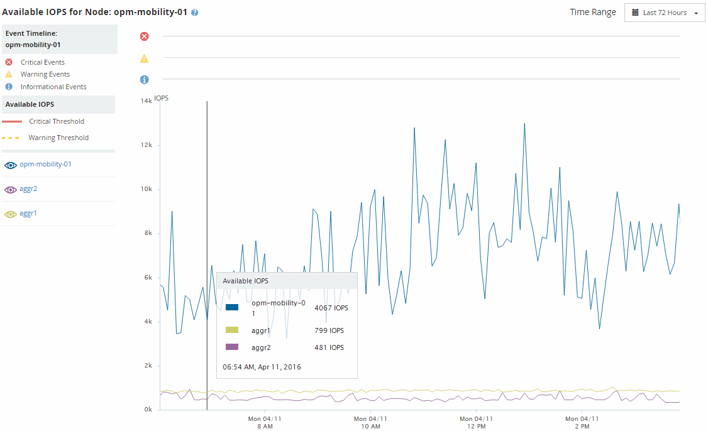

= Viewing node and aggregate available IOPS values
:icons: font
:imagesdir: ../media/

[.lead]
You can monitor the available IOPS values for all nodes or for all aggregates in a cluster, or you can view details for a single node or aggregate.

Available IOPS values appear in the Performance Inventory pages and in the Performance Explorer page charts for nodes and aggregates. For example, when viewing a node in the Node/Performance Explorer page, you can select the "`Available IOPS`" counter chart from the list so you can compare the available IOPS values for the node and multiple aggregates on that node.

Monitoring the available IOPS counter enables you to identify:

* The nodes or aggregates that have the greatest available IOPS values to help determine where future workloads can be deployed.
* The nodes or aggregates that have the smallest available IOPS values to identify the resources you should monitor for potential future performance issues.
* The busiest volumes and LUNs on an aggregate that has a small available IOPS value.
