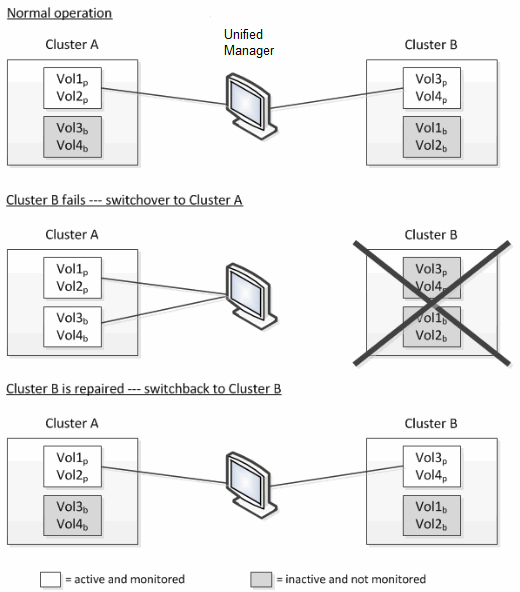

= Volume behavior during switchover and switchback
:icons: font
:imagesdir: ../media/

[.lead]
Events that trigger a switchover or switchback cause active volumes to be moved from one cluster to the other cluster in the disaster recovery group. The volumes on the cluster that were active and serving data to clients are stopped, and the volumes on the other cluster are activated and start serving data. Unified Manager monitors only those volumes that are active and running.

Because volumes are moved from one cluster to another, it is recommended that you monitor both clusters. A single instance of Unified Manager can monitor both clusters in a MetroCluster configuration, but sometimes the distance between the two locations necessitates using two Unified Manager instances to monitor both clusters. The following figure shows a single instance of Unified Manager:

The volumes with p in their names indicate the primary volumes, and the volumes with b in their names are mirrored backup volumes that are created by SnapMirror.

During normal operation:

* Cluster A has two active volumes: Vol1p and Vol2p.
* Cluster B has two active volumes: Vol3p and Vol4p.
* Cluster A has two inactive volumes: Vol3b and Vol4b.
* Cluster B has two inactive volumes: Vol1b and Vol2b.

Information pertaining to each of the active volumes (statistics, events, and so on) is collected by Unified Manager. Vol1p and Vol2p statistics are collected by Cluster A, and Vol3p and Vol4p statistics are collected by Cluster B.

After a catastrophic failure causes a switchover of active volumes from Cluster B to Cluster A:

* Cluster A has four active volumes: Vol1p, Vol2p, Vol3b, and Vol4b.
* Cluster B has four inactive volumes: Vol3p, Vol4p, Vol1b, and Vol2b.

As during normal operation, information pertaining to each of the active volumes is collected by Unified Manager. But in this case, Vol1p and Vol2p statistics are collected by Cluster A, and Vol3b and Vol4b statistics are also collected by Cluster A.

Note that Vol3p and Vol3b are not the same volumes, because they are on different clusters. The information in Unified Manager for Vol3p is not the same as Vol3b:

* During switchover to Cluster A, Vol3p statistics and events are not visible.
* On the very first switchover, Vol3b looks like a new volume with no historical information.

When Cluster B is repaired and a switchback is performed, Vol3p is active again on Cluster B, with the historical statistics and a gap of statistics for the period during the switchover. Vol3b is not viewable from Cluster A until another switchover occurs:

image::../media/opm_mcc_volumes.gif[]

[NOTE]
====

* MetroCluster volumes that are inactive, for example, Vol3b on Cluster A after switchback, are identified with the message "`This volume was deleted`". The volume is not actually deleted, but it is not currently being monitored by Unified Manager because it is not the active volume.
* If a single Unified Manager is monitoring both clusters in a MetroCluster configuration, volume search returns information for whichever volume is active at that time. For example, a search for "`Vol3`" would return statistics and events for Vol3b on Cluster A if a switchover has occurred and Vol3 has become active on Cluster A.

====
