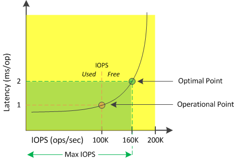

= What available IOPS is
:icons: font
:imagesdir: ../media/

[.lead]
The available IOPS counter identifies the remaining number of IOPS that can be added to a node or an aggregate before the resource reaches its limit.

The total IOPS that a node can provide is based on the physical characteristics of the node--for example, the number of CPUs, the CPU speed, and the amount of RAM. The total IOPS that an aggregate can provide is based on the physical properties of the disks--for example, a SATA, SAS, or SSD disk.

The total IOPS of all the volumes in an aggregate might not match the total IOPS of the aggregate. This is discussed in the following knowledge base article: KB link:https://kb.netapp.com/Advice_and_Troubleshooting/Data_Infrastructure_Management/Active_IQ_Unified_Manager/Why_does_the_sum_of_all_volume_IOPs_in_an_aggregate_not_match_the_aggregate_IOPs%3F[Why does the sum of all volume IOPs in an aggregate not match the aggregate IOPs?]

While the performance capacity free counter provides the percentage of a resource that is still available, the available IOPS counter tells you the exact number of IOPS (workloads) can be added to a resource before reaching the maximum performance capacity.

For example, if you are using a pair of FAS2520 and FAS8060 storage systems, a performance capacity free value of 30% means that you have some free performance capacity. However, that value does not provide visibility into how many more workloads you can deploy to those nodes. The available IOPS counter may show that you have 500 available IOPS on the FAS8060, but only 100 available IOPS on the FAS2520.

A sample latency versus IOPS curve for a node is shown in the following figure.

The maximum number of IOPS that a resource can provide is the number of IOPS when the performance capacity used counter is at 100% (the optimal point). The operational point identifies that the node is currently operating at 100K IOPS with latency of 1.0 ms/op. Based on the statistics captured from the node, Unified Manager determines that the maximum IOPS for the node is 160K, which means that there are 60K free or available IOPS. Therefore, you can add more workloads to this node so that your systems are used more efficiently.

[NOTE]
====
When there is minimal user activity in the resource, the available IOPS value is calculated assuming a generic workload based on approximately 4,500 IOPS per CPU core. This is because Unified Manager lacks the data to accurately estimate the characteristics of the workload being served.
====
