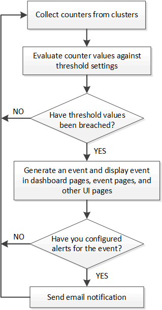

= What happens when an event is received
:icons: font
:imagesdir: ../media/

[.lead]
When Unified Manager receives an event, it is displayed in the Dashboard page, in the Event Management inventory page, in the Summary and Explorer tabs of the Cluster/Performance page, and in the object-specific inventory page (for example, the Volumes/Health inventory page).

When Unified Manager detects multiple continuous occurrences of the same event condition for the same cluster component, it treats all occurrences as a single event, not as separate events. The duration of the event is incremented to indicate that the event is still active.

Depending on how you configure settings in the Alert Setup page, you can notify other users about these events. The alert causes the following actions to be initiated:

* An email about the event can be sent to all Unified Manager Administrator users.
* The event can be sent to additional email recipients.
* An SNMP trap can be sent to the trap receiver.
* A custom script can be executed to perform an action.

This workflow is shown in the following diagram.

