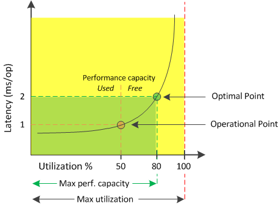

= What performance capacity used is
:icons: font
:imagesdir: ../media/

[.lead]
The performance capacity used counter helps you to identify whether the performance of a node or an aggregate is reaching a point where the performance might degrade if the workloads increase. It can also show you if a node or aggregate is currently being overused during specific periods of time. Performance capacity used is similar to utilization, but the former provides more insight about the available performance capabilities in a physical resource for a specific workload.

The optimal used performance capacity is the point at which a node or an aggregate has optimal utilization and latency (response time), and is being used efficiently. A sample latency versus utilization curve is shown for an aggregate in the following figure.

In this example, the _operational point_ identifies that the aggregate is currently operating at 50% utilization with latency of 1.0 ms/op. Based on the statistics captured from the aggregate, Unified Manager determines that additional performance capacity is available for this aggregate. In this example, the _optimal point_ is identified as the point when the aggregate is at 80% utilization with latency of 2.0 ms/op. Therefore, you can add more volumes and LUNs to this aggregate so that your systems are used more efficiently.

The performance capacity used counter is expected to be a larger number than the "`utilization`" counter because performance capacity adds in the impact on latency. For example, if a node or aggregate is 70% used, the performance capacity value may be in the 80% to 100% range, depending on the latency value.

In some cases, however, the utilization counter may be higher on the Dashboard page. This is normal because the dashboard refreshes the current counter values at each collection period; it does not display averages over a period of time like the other pages in the Unified Manager user interface. The performance capacity used counter is best used as an indicator of performance averaged over a period of time, whereas the utilization counter is best used for determining the instantaneous usage of a resource.
