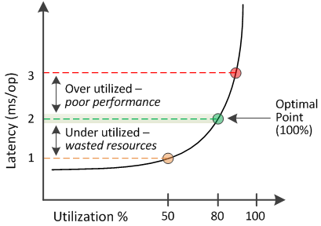

= What the performance capacity used value means
:icons: font
:imagesdir: ../media/

[.lead]
The performance capacity used value helps you identify the nodes and aggregates that are currently being overutilized or underutilized. This enables you to redistribute workloads in order to make your storage resources more efficient.

The following figure shows the latency versus utilization curve for a resource and identifies, with colored dots, three areas where the current operational point could be located.

* A performance capacity used percentage equal to 100 is at the optimal point.
+
Resources are being used efficiently at this point.

* A performance capacity used percentage above 100 indicates that the node or aggregate is overutilized, and that workloads are receiving sub-optimal performance.
+
No new workloads should be added to the resource, and the existing workloads may need to be redistributed.

* A performance capacity used percentage below 100 indicates that the node or aggregate is underutilized, and that resources are not being used effectively.
+
More workloads can be added to the resource.

[NOTE]
====
Unlike utilization, the performance capacity used percentage can be above 100%. There is no maximum percentage, but resources will typically be in the 110% to 140% range when they are being overutilized. Higher percentages would indicate a resource with serious issues.
====
