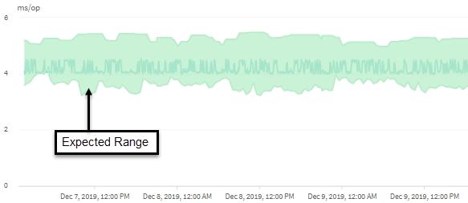

= How the latency forecast is used in performance analysis
:icons: font
:imagesdir: ../media/

[.lead]
Unified Manager uses the latency forecast to represent the typical I/O latency (response time) activity for your monitored workloads. It alerts you when the actual latency for a workload is above the upper bounds of the latency forecast, which triggers a dynamic performance event, so that you can analyze the performance issue and take corrective action for resolving it.

The latency forecast sets the performance baseline for the workload. Over time, Unified Manager learns from past performance measurements to forecast the expected performance and activity levels for the workload. The upper boundary of the expected range establishes the dynamic performance threshold. Unified Manager uses the baseline to determine when the actual latency is above or below a threshold, or outside the bounds of their expected range. The comparison between the actual values and the expected values creates a performance profile for the workload.

When the actual latency for a workload exceeds the dynamic performance threshold, due to contention on a cluster component, the latency is high and the workload performs more slowly than expected. The performance of other workloads that share the same cluster components might also be slower than expected.

Unified Manager analyzes the threshold crossing event and determines whether the activity is a performance event. If the high workload activity remains consistent for a long period of time, such as several hours, Unified Manager considers the activity to be normal and dynamically adjusts the latency forecast to form the new dynamic performance threshold.

Some workloads might have consistently low activity, where the latency forecast for latency does not have a high rate of change over time. To minimize the number of events during analysis of performance events, Unified Manager triggers an event only for low-activity volumes whose operations and latencies are much higher than expected.

In this example, the latency for a volume has a latency forecast, in gray, of 3.5 milliseconds per operation (ms/op) at its lowest and 5.5 ms/op at its highest. If the actual latency, in blue, suddenly increases to 10 ms/op, due to an intermittent spike in network traffic or contention on a cluster component, it is then above the latency forecast and has exceeded the dynamic performance threshold.

When network traffic has decreased, or the cluster component is no longer in contention, the latency returns within the latency forecast. If the latency remains at or above 10 ms/op for a long period of time, you might need to take corrective action to resolve the event.
