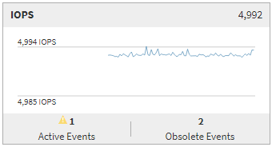

= Summary page
:icons: font
:imagesdir: ../media/

[.lead]
The Summary page displays counter charts that contain details about the events and performance per object for the preceding 72-hour period. This data is not automatically refreshed, but is current as of the last page load. The charts in the Summary page answer the question _Do I need to look further?_

== Charts and counter statistics

The summary charts provide a quick, high-level overview for the last 72-hour period, and help you to identify possible issues that require further investigation.

The Summary page counter statistics are displayed in graphs.

You can position your cursor over the trend line in a graph to view the counter values for a particular point in time. The summary charts also display the total number of active critical and warning events for the preceding 72-hour period for the following counters:

* *Latency*
+
Average response time for all I/O requests; expressed in milliseconds per operation.
+
Displayed for all object types.

* *IOPS*
+
Average operating speed; expressed in input/output operations per second.
+
Displayed for all object types.

* *MB/s*
+
Average throughput; expressed in megabytes per second.
+
Displayed for all object types.

* *Performance Capacity Used*
+
Percentage of performance capacity that is being consumed by a node or aggregate.
+
Displayed for nodes and aggregates only.

* *Utilization*
+
Percentage of object utilization for nodes and aggregates, or bandwidth utilization for ports.
+
Displayed for nodes, aggregates, and ports only.

Positioning the cursor over the event count for Active events shows the type and number of events. Critical events are displayed in red (image:../media/treemapred_png.gif[Icon for TreeMap – Red color]), and warning events are displayed in yellow (image:../media/treemapstatus_warning_png.gif[Icon for TreeMap – Warning status]).

The number at the top right of the chart in the gray bar is the average value from the last 72-hour period. Numbers shown at the bottom and top of the trend line graph are the minimum and maximum values for the last 72-hour period. The gray bar below the chart contains the count of active (new and acknowledged) events and obsolete events from the last 72-hour period.

* *Latency counter chart*
+
The Latency counter chart provides a high-level overview of the object latency for the preceding 72-hour period. Latency refers to the average response time for all I/O requests; expressed in milliseconds per operation, the service time, wait time, or both experienced by a data packet or block in the cluster storage component under consideration.
+
*Top (counter value):* The number in the header displays the average for the preceding 72-hour period.
+
*Middle (performance graph):* The number at the bottom of the graph displays the lowest latency, and the number at the top of the graph displays the highest latency for the preceding 72-hour period. Position your cursor over the graph trend line to view the latency value for a specific time.
+
*Bottom (events):* On hover, the pop-up displays the details of the events. Click the *Active Events* link below the graph to navigate to the Events Inventory page to view complete event details.

* *IOPS counter chart*
+
The IOPS counter chart provides a high-level overview of the object IOPS health for the preceding 72-hour period. IOPS indicates the speed of the storage system in number of input/output operations per second.
+
*Top (counter value):* The number in the header displays the average for the preceding 72-hour period.
+
*Middle (performance graph):* The number at the bottom of the graph displays the lowest IOPS, and the number at the top of the graph displays the highest IOPS for the preceding 72-hour period. Position your cursor over the graph trend line to view the IOPS value for a specific time.
+
*Bottom (events):* On hover, the pop-up displays the details of the events. Click the *Active Events* link below the graph to navigate to the Events Inventory page to view complete event details.

* *MB/s counter chart*
+
The MB/s counter chart displays the object MB/s performance, and indicates how much data has been transferred to and from the object in megabytes per second. The MB/s counter chart provides a high-level overview of the object's MB/s health for the preceding 72-hour period.
+
*Top (counter value):* The number in the header displays the average number of MB/s for the preceding 72-hour period.
+
*Middle (performance graph):* The value at the bottom of the graph displays the lowest number of MB/s, and the value at the top of the graph displays the highest number of MB/s for the preceding 72-hour period. Position your cursor over the graph trend line to view the MB/s value for a specific time.
+
*Bottom (events):* On hover, the pop-up displays the details of the events. Click the *Active Events* link below the graph to navigate to the Events Inventory page to view complete event details.

* *Performance Capacity Used counter chart*
+
The Performance Capacity Used counter chart displays the percentage of performance capacity that is being consumed by the object.
+
*Top (counter value):* The number in the header displays the average used performance capacity for the preceding 72-hour period.
+
*Middle (performance graph):* The value at the bottom of the graph displays the lowest used performance capacity percentage, and the value at the top of the graph displays the highest used performance capacity percentage for the preceding 72-hour period. Position your cursor over the graph trend line to view the used performance capacity value for a specific time.
+
*Bottom (events):* On hover, the pop-up displays the details of the events. Click the *Active Events* link below the graph to navigate to the Events Inventory page to view complete event details.

* *Utilization counter chart*
+
The Utilization counter chart displays the object utilization percentage. The Utilization counter chart provides a high-level overview of the percentage of the object or bandwidth utilization for the preceding 72-hour period.
+
*Top (counter value):* The number in the header displays the average utilization percentage for the preceding 72-hour period.
+
*Middle (performance graph):* The value at the bottom of the graph displays the lowest utilization percentage, and the value at the top of the graph displays the highest utilization percentage for the preceding 72-hour period. Position your cursor over the graph trend line to view the utilization value for a specific time.
+
*Bottom (events):* On hover, the pop-up displays the details of the events. Click the *Active Events* link below the graph to navigate to the Events Inventory page to view complete event details.

== Events

The events history table, where applicable, lists the most recent events that occurred on that object. Clicking the event name displays details of the event on the Event Details page.
