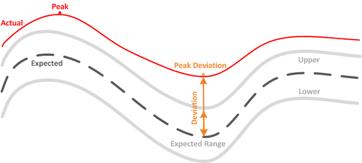

= Workload performance measurement values
:icons: font
:imagesdir: ../media/

[.lead]
Unified Manager measures the performance of workloads on a cluster based on historical and expected statistical values, which form the latency forecast of values for the workloads. It compares the actual workload statistical values to the latency forecast to determine when workload performance is too high or too low. A workload that is not performing as expected triggers a dynamic performance event to notify you.

In the following illustration, the actual value, in red, represents the actual performance statistics in the time frame. The actual value has crossed the performance threshold, which is the upper bounds of the latency forecast. The peak is the highest actual value in the time frame. The deviation measures the change between the expected values (the forecast) and the actual values, while the peak deviation indicates the largest change between the expected values and the actual values.

The following table lists the workload performance measurement values.
[options="header"]
|===
| Measurement| Description
a|
Activity
a|
The percentage of the QoS limit used by the workloads in the policy group.

[NOTE]
====
If Unified Manager detects a change to a policy group, such as adding or removing a volume or changing the QoS limit, the actual and expected values might exceed 100% of the set limit. If a value exceeds 100% of the set limit it is displayed as >100%. If a value is less than 1% of the set limit it is displayed as <1%.
====

a|
Actual
a|
The measured performance value at a specific time for a given workload.
a|
Deviation
a|
The change between the expected values and the actual values. It is the ratio of the actual value minus the expected value to the upper value of the expected range minus the expected value.

[NOTE]
====
A negative deviation value indicates that workload performance is lower than expected, while a positive deviation value indicates that workload performance is higher than expected.
====

a|
Expected
a|
The expected values are based on the analysis of historical performance data for a given workload. Unified Manager analyzes these statistical values to determine the expected range (latency forecast) of values.
a|
Latency Forecast (Expected Range)
a|
The latency forecast is a prediction of what the upper and lower performance values are expected to be at a specific time. For the workload latency, the upper values form the performance threshold. When the actual value crosses the performance threshold, Unified Manager triggers a dynamic performance event.
a|
Peak
a|
The maximum value measured over a period of time.
a|
Peak Deviation
a|
The maximum deviation value measured over a period of time.
a|
Queue Depth
a|
The number of pending I/O requests that are waiting at the interconnect component.
a|
Utilization
a|
For the network processing, data processing, and aggregate components, the percentage of busy time to complete workload operations over a period of time. For example, the percentage of time for the network processing or data processing components to process an I/O request or for an aggregate to fulfill a read or write request.
a|
Write Throughput
a|
The amount of write throughput, in Megabytes per second (MB/s), from workloads on a local cluster to the partner cluster in a MetroCluster configuration.
|===
