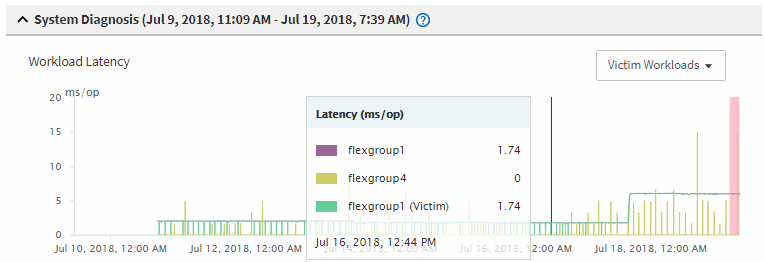

= Analyzing a dynamic performance event on a cluster in a MetroCluster configuration
:icons: font
:imagesdir: ../media/

[.lead]
You can use Unified Manager to analyze the cluster in a MetroCluster configuration on which a performance event was detected. You can identify the cluster name, event detection time, and the bully and victim workloads involved.

* You must have the Operator, Application Administrator, or Storage Administrator role.
* There must be new, acknowledged, or obsolete performance events for a MetroCluster configuration.
* Both clusters in the MetroCluster configuration must be monitored by the same instance of Unified Manager.

. Display the Event details page to view information about the event.
. Review the event description to see the names of the workloads involved and the number of workloads involved.
+
In this example, the MetroCluster Resources icon is red, indicating that the MetroCluster resources are in contention. You position your cursor over the icon to display a description of the icon.
+
image::../media/opm_mcc_incident_summary_png.gif[Summary of performance event for MetroCluster configuration]

. Make a note of the cluster name and the event detection time, which you can use to analyze performance events on the partner cluster.
. In the charts, review the victim workloads to confirm that their response times are higher than the performance threshold.
+
In this example, the victim workload is displayed in the hover text. The Latency charts display, at a high-level, a consistent latency pattern for the victim workloads involved. Even though the abnormal latency of the victim workloads triggered the event, a consistent latency pattern might indicate that the workloads are performing within their expected range, but that a spike in I/O increased the latency and triggered the event.
+

+
If you recently installed an application on a client that accesses these volume workloads and that application sends a high amount of I/O to them, you might be anticipating their latencies to increase. If the latency for the workloads returns within the expected range, the event state changes to obsolete, and remains in this state for more than 30 minutes, you can probably ignore the event. If the event is ongoing, and remains in the new state, you can investigate it further to determine whether other issues caused the event.

. In the Workload Throughput chart, select *Bully Workloads* to display the bully workloads.
+
The presence of bully workloads indicates that the event might have been caused by one or more workloads on the local cluster overutilizing the MetroCluster resources. The bully workloads have a high deviation in write throughput (MB/s).
+
This chart displays, at a high-level, the write throughput (MB/s) pattern for the workloads. You can review the write MB/s pattern to identify abnormal throughput, which might indicate that a workload is over-utilizing the MetroCluster resources.
+
If no bully workloads are involved in the event, the event might have been caused by a health issue with the link between the clusters or a performance issue on the partner cluster. You can use Unified Manager to check the health of both clusters in a MetroCluster configuration. You can also use Unified Manager to check for and analyze performance events on the partner cluster.

*Related information*

xref:concept_performance_incident_analysis_for_a_metrocluster_configuration.adoc[Performance event analysis for a MetroCluster configuration]

xref:task_analyzing_a_performance_incident_on_a_remote_cluster_in_a_metrocluster_configuration.adoc[Analyzing a dynamic performance event for a remote cluster on a MetroCluster configuration]

xref:concept_performance_monitoring_of_metrocluster_configurations.adoc[Performance monitoring of MetroCluster configurations]

xref:reference_performance_event_analysis_and_notification.adoc[Performance event analysis and notification]

xref:concept_roles_of_workloads_involved_in_a_performance_incident.adoc[Roles of workloads involved in a performance event]
