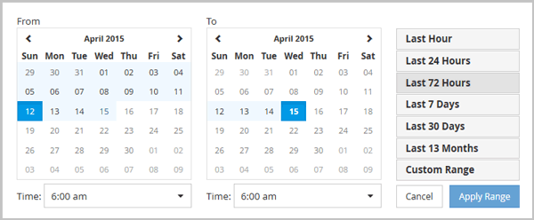

= Specifying the time range in Zoom View
:icons: font
:imagesdir: ../media/

[.lead]
The *Time Range* control in the Counter Charts Zoom View window enables you to specify a date and time range for the selected chart. This enables you to quickly locate specific data based on either a preset time range or your own custom time range.

You can select a time range between one hour and 390 days. 13 months equals 390 days because each month is counted as 30 days. Specifying a date and time range provides more detail and enables you to zoom in on specific performance events or series of events. Specifying a time range also aids in troubleshooting potential performance issues, as specifying a date and time range displays data surrounding the performance event in finer detail. Use the *Time Range* control to select predefined date and time ranges, or specify your own custom date and time range of up to 390 days. Buttons for predefined time ranges vary from the *Last Hour* through the *Last 13 Months*.

Selecting the *Last 13 Months* option or specifying a custom date range greater than 30 days displays a dialog box alerting you that performance data displayed for a period greater than 30 days is charted using hourly averages and not 5-minute data polling. Therefore, a loss of timeline visual granularity might occur. If you click the *Do not show again* option in the dialog box, the message does not appear when you select the *Last 13 Months* option or specify a custom date range greater than 30 days. Summary data also applies on a smaller time range, if the time range includes a time/date that is more than 30 days from today.

When selecting a time range (either custom or predefined), time ranges of 30 days or fewer are based on 5-minute interval data samples. Time ranges greater than 30 days are based on one-hour interval data samples.

. Click the *Time Range* drop-down box and the Time Range panel displays.
. To select a predefined time range, click one of the *Last...* buttons at the right of the *Time Range* panel. When selecting a predefined time range, data for up to 13 months is available. The predefined time range button you selected is highlighted, and the corresponding days and time display in the calendars and time selectors.
. To select a custom date range, click the start date in the *From* calendar on the left. Click *<* or *>* to navigate forward or backward in the calendar. To specify the end date, click a date in the *To* calendar on the right. Note that the default end date is today unless you specify a different end date. The *Custom Range* button at the right of the Time Range panel is highlighted, indicating that you have selected a custom date range.
. To select a custom time range, click the *Time* control below the *From* calendar and select the start time. To specify the end time, click the *Time* control below the *To* calendar on the right and select the end time. The *Custom Range* button at the right of the Time Range panel is highlighted, indicating that you have selected a custom time range.
. Optionally, you can specify the start and end times when selecting a predefined date range. Select the predefined date range as previously described, then select the start and end times as previously described. The selected dates are highlighted in the calendars, your specified start and end times display in the *Time* controls, and the *Custom Range* button is highlighted.
. After selecting the date and time range, click *Apply Range*. The performance statistics for that time range display in the charts and in the Events timeline.
