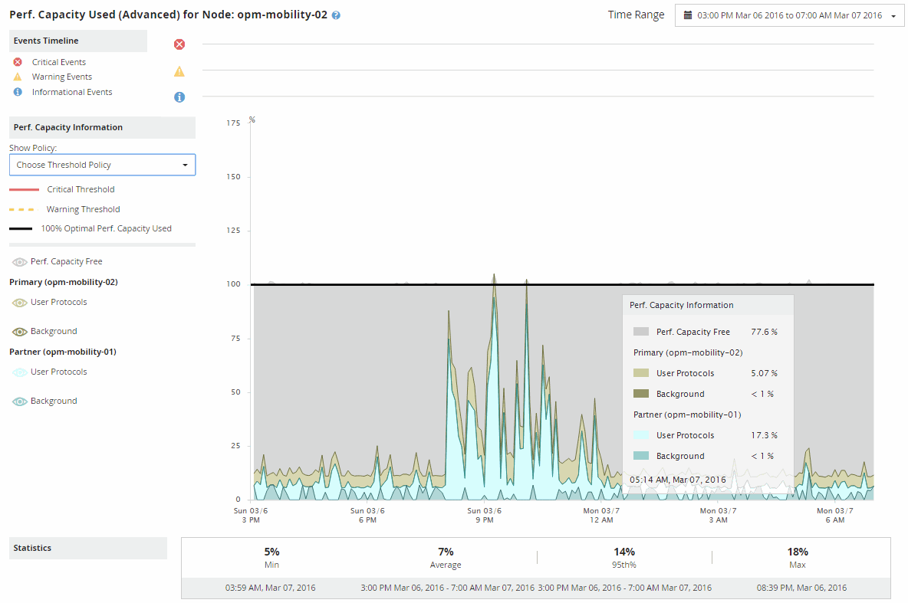

= Using the Performance Capacity Used Breakdown chart for failover planning
:icons: font
:imagesdir: ../media/

[.lead]
The detailed Performance Capacity Used - Breakdown chart shows the performance capacity used for the Primary node and the Partner node. It also shows the amount of free performance capacity on the Estimated Takeover node. This information helps you determine whether you might have a performance issue if the partner node fails.

In addition to showing the total performance capacity used for the nodes, the Breakdown chart breaks the values for each node into user protocols and background processes.

* User protocols are the I/O operations from user applications to and from the cluster.
* Background processes are the internal system processes involved with storage efficiency, data replication, and system health.

This additional level of detail enables you to determine whether a performance issue is caused by user application activity or background system processes, such as deduplication, RAID reconstruct, disk scrubbing, and SnapMirror copies.

.Steps
. Go to the *Performance/Node Failover Planning* page for the node that will serve as the Estimated Takeover node.
. From the *Time Range* selector, choose the period of time for which the historical statistics are displayed in the counter grid and counter charts.
+
The counter charts with statistics for the Primary node, Partner node, and Estimated Takeover node are displayed.

. From the *Choose charts* list, select *Perf. Capacity Used*.
. In the *Perf. Capacity Used* chart, select *Breakdown* and click *Zoom View*.
+
The detailed chart for Perf. Capacity Used is displayed.
+

. Move the cursor over the detailed chart to view the performance capacity used information in the popup window.
+
The Perf. Capacity Free percentage is the performance capacity available on the Estimated Takeover node. It indicates how much performance capacity is left on the takeover node after a failover. If it is 0%, a failover will cause the latency to increase to an unacceptable level on the takeover node.

. Consider taking corrective actions to avoid a low performance capacity free percentage.
+
If you plan to initiate a failover for node maintenance, choose a time to fail the partner node when the performance capacity free percentage is not at 0.
