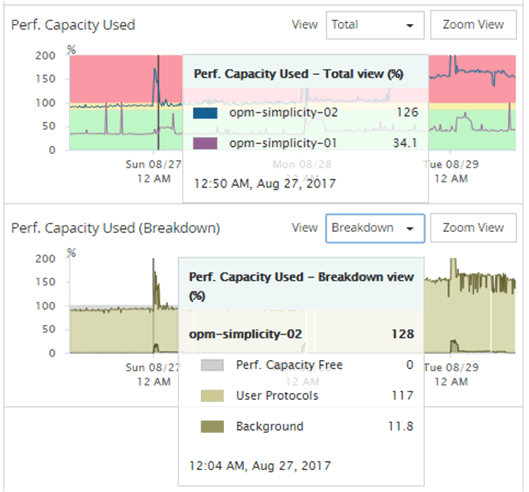

= Viewing performance capacity counter charts to identify issues
:icons: font
:imagesdir: ../media/

[.lead]
You can view performance capacity used charts for nodes and aggregates on the Performance Explorer page. This enables you to view detailed performance capacity data for the selected nodes and aggregates for a specific timeframe.

The standard counter chart displays the performance capacity used values for the selected nodes or aggregates. The Breakdown counter chart displays the total performance capacity values for the root object separated into usage based on user protocols versus background system processes. Additionally, the amount of free performance capacity is also shown.

[NOTE]
====
Because some background activities associated with system and data management are identified as user workloads and categorized as user protocols, the user protocols percentage may appear artificially high when those processes run. These processes typically run around midnight when cluster usage is low. If you see a spike in user protocol activity around midnight, verify if cluster backup jobs or other background activities are configured to run at that time.
====
.Steps
. Select the *Explorer* tab from a node or aggregate *Landing* page.
. In the *Counter Charts* pane, click *Choose charts*, and then select the *Perf. Capacity Used* chart.
. Scroll down until you can view the chart.
+
The colors of the standard chart show when the object is in the optimal range (yellow), when the object is underutilized (green), and when the object is overutilized (red). The Breakdown chart shows detailed performance capacity details for the root object only.
+

. If you want to view either chart in a full size format, click *Zoom View*.
+
In this manner you can open multiple counter charts in a separate windows to compare performance capacity used values with IOPS or MBps values over the same timeframe.
