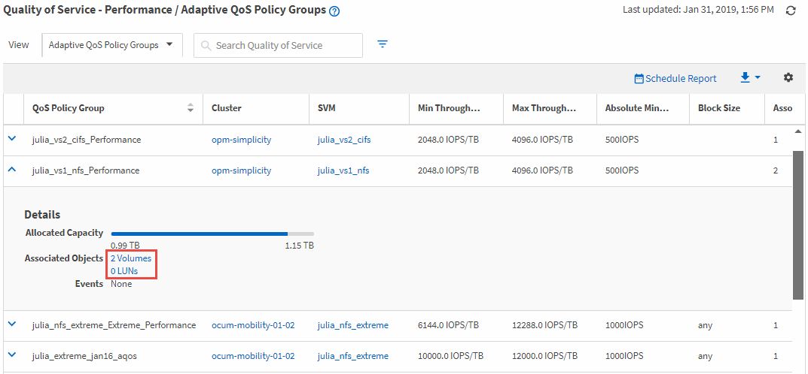

= Viewing volumes or LUNs that are in the same QoS policy group
:icons: font
:imagesdir: ../media/

[.lead]
You can display a list of the volumes and LUNs that have been assigned to the same QoS policy group.

In the case of traditional QoS policy groups that are "`shared`" among multiple volumes, this can be helpful to see if certain volumes are overusing the throughput defined for the policy group. It can also help you decide if you can add other volumes to the policy group without a negative affect to the other volumes.

In the case of adaptive QoS policies and Unified Manager Performance Service Levels policies, this can be helpful to view all the volumes or LUNs that are using a policy group so that you can see which objects would be affected if you changed the configuration settings for the QoS policy.

.Steps
. In the left navigation pane, click *Storage* > *QoS Policy Groups*.
+
The Performance: Traditional QoS Policy Groups view is displayed by default.

. If you are interested in traditional policy group, stay on this page. Otherwise, select one of the additional View options to display all the adaptive QoS policy groups or all the QoS policy groups that were created by Unified Manager Performance Service Levels.
. In the QoS policy that you are interested in, click the expand button (image:../media/chevron_down.gif[expand button icon]) next to the QoS Policy Group name to view more details.
. Click the Volumes or the LUNs link to view the objects using this QoS policy.
+
The Performance inventory page for Volumes or LUNs is displayed with the sorted list of objects that are using the QoS policy.
