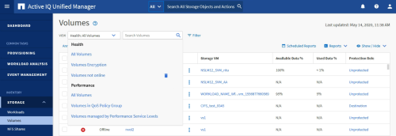

= Understanding the view and report relationship
:icons: font
:imagesdir: ../media/

[.lead]
Views and inventory pages become reports when you download or schedule them.

You can customize and save views and inventory pages for reuse. Almost everything you can view in Unified Manager can be saved, reused, customized, scheduled, and shared as a report.

In the view drop down, items with the delete icon are existing custom views that you or another user have created. Items without an icon are default views provided with Unified Manager. Default views cannot be modified or deleted.

[NOTE]
====

* If you delete a custom view from the list, it also deletes any Excel files or scheduled reports that use that view.
* If you change a custom view, reports that use that view will reflect the change the next time the report is generated and sent by email according to the report schedule. When changing views, make sure your changes work with any associated Excel customizations used for the reports. If needed, you can update the Excel file by downloading it, making the required changes, and uploading it as a new Excel customization for the view.

====

Only users with the Application Administrator or Storage Administrator role can see the delete icon, change or delete a view, or change or delete a scheduled report.
