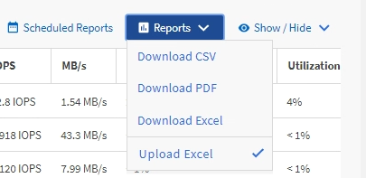

= Creating a report to show aggregate total versus available capacity charts
:icons: font
:imagesdir: ../media/

[.lead]
You can create a report to analyze storage total and committed capacity in an Excel chart format.

*What you'll need*

* You must have the Application Administrator or Storage Administrator role.

Use the following steps to open a Health: All Aggregates view, download the view in Excel, create a total and committed capacity chart, upload the customized Excel file, and schedule the final report.

.Steps

. In the left navigation pane, click *Storage* > *Aggregates*.
. Select *Reports* > *Download Excel*.
+
image::../media/download_excel_menu.png[A UI screenshot that shows how to download excel from reports.]
+
Depending on your browser, you might need to click *OK* to save the file.

. In Excel, open the downloaded file.
. If needed, click *Enable Editing*.
. On the data sheet, right-click the Type column and select *Sort* > *Sort A to Z*.
+
image::../media/sort_01.png[A UI screenshot that shows how to select sort in the type column.]
+
This will arrange your data by storage type, such as:

 ** HDD
 ** Hybrid
 ** SSD
 ** SSD (FabricPool)

. Select the `Type, Total Data Capacity,` and `Available Data Capacity` columns.
. On the *Insert* menu, select a `3-D column` chart.
+
The chart appears on the data sheet.
+
image::../media/3d_column_01.png[A UI screenshot that shows the 3D column chart.]

. Right-click the chart and select *Move Chart*.
. Select *New sheet* and name the sheet *Total Storage Charts*.
+
[NOTE]
====
Make sure the new sheet appears after the info and data sheets.
====

. Name the chart title *Total versus Available Capacity*.
. Using the *Design* and *Format* menus, available when the chart is selected, you can customize how the chart looks.
. When satisfied, save the file with your changes. Do not change the file name or location.
+
image::../media/total_vs_available_capacity.png[A UI screenshot that shows total versus available capacity chart.]

. In Unified Manager, select *Reports* > *Upload Excel*.
+
[NOTE]
====
Make sure you are in the same view where you downloaded the Excel file.
====

. Select the Excel file you have modified.
. Click *Open*.
. Click *Submit*.
+
A check mark appears beside the *Reports* > *Upload Excel* menu item.
+

. Click *Scheduled Reports*.
. Click *Add Schedule* to add a new row to the *Report Schedules* page so that you can define the schedule characteristics for the new report.
+
[NOTE]
====
Select the *XLSX* format for the report.
====

. Enter a name for the report schedule and complete the other report fields, then click the check mark (image:../media/blue_check.gif[]) at the end of the row.
+
The report is sent immediately as a test. After that, the report generates and is sent by email to the recipients listed using the specified frequency.

Based on the results shown in the report, you might want to balance the load on your aggregates.
