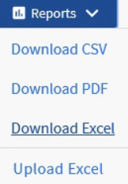
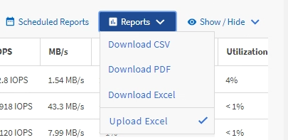

= Creating a report to view aggregates that have the most available IOPS
:icons: font
:imagesdir: ../media/

[.lead]
This report shows which aggregates have the most available IOPS per aggregate type on which you can provision new workloads.

*What you'll need*

* You must have the Application Administrator or Storage Administrator role.

Use the following steps to open a Health: All Volumes view, download the view in Excel, create an available capacity chart, upload the customized Excel file, and schedule the final report.

.Steps

. In the left navigation pane, click *Storage* > *Aggregates*.
. Select *Performance: All Aggregates* from the *View* drop-down.
. Select *Show/Hide* to show the `Available IOPS` column and hide the `Cluster FQDN, Inactive Data Reporting,` and `Threshold Policy` columns.
. Drag and drop the `Available IOPS` and `Free Capacity` columns next to the `Type` column.
. Name and save the custom view `Available IOPS Per Aggr.`
. Select *Reports* > *Download Excel*.
+

+
Depending on your browser, you might need to click *OK* to save the file.

. If needed, click *Enable Editing*.
. In Excel, open the downloaded file.
. On the data sheet, click the little triangle at the top-left of the sheet to select the entire sheet.
. On the *Data* ribbon, select *Sort* from the `Sort & Filter area.`
. Set the following sort levels:
 .. Specify the *Sort by* as `Available IOPS` (IOPS), the *Sort On* as `Cell Values,` and the *Order* as `Largest to Smallest.`
 .. Click *Add Level*.
 .. Specify the *Sort by* as `Type`, the *Sort On* as `Cell Values,` and the *Order* as `Z to A.`
 .. Click *Add Level*.
 .. Specify the *Sort by* as `Free Capacity (GB),` the *Sort On* as `Cell Values,` and the *Order* as `Largest to Smallest.`
 .. Click *OK*.
. Save and close the Excel file.
. In Unified Manager, select *Reports* > *Upload Excel*.
+
[NOTE]
====
Make sure you are in the same view where you downloaded the Excel file.
====

. Select the Excel file you have modified, in this case `performance-aggregates-<date>.xlsx.`
. Click *Open*.
. Click *Submit*.
+
A check mark appears beside the *Reports* > *Upload Excel* menu item.
+

. Click *Scheduled Reports*.
. Click *Add Schedule* to add a new row to the Report Schedules page so that you can define the schedule characteristics for the new report.
. Enter a name for the report schedule and complete the other report fields, then click the check mark (image:../media/blue_check.gif[]) at the end of the row.
+
[NOTE]
====
Select the *XLSX* format for the report.
====
+
The report is sent immediately as a test. After that, the report generates and is sent by email to the recipients listed using the specified frequency.

Based on the results shown in the report, you might want to provision new workloads on the aggregates that have the greatest available IOPS.
