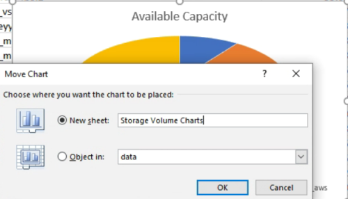

= Creating a report to view available volume capacity charts
:icons: font
:imagesdir: ../media/

[.lead]
You can create a report to analyze available volume capacity in an Excel chart.

*What you'll need*

* You must have the Application Administrator or Storage Administrator role.

Use the following steps to open a Health: All Volumes view, download the view in Excel, create an available capacity chart, upload the customized Excel file, and schedule the final report.

.Steps

. In the left navigation pane, click *Storage* > *Volumes*.
. Select *Reports* > *Download Excel*.
+
image::../media/download_excel_menu.png[A UI screenshot that shows how to download excel from reports.]
+
Depending on your browser, you might need to click *OK* to save the file.

. If needed, click *Enable Editing*.
. In Excel, open the downloaded file.
. On the `data` sheet, select the data that you want to use in the `Volume` and `Available Data` % columns.
. On the *Insert* menu, select a `3-D piechart.`
+
The chart shows which volumes have the largest available space. The chart appears on the data sheet.
+
[NOTE]
====
Depending on your network configuration, selecting the entire columns or too many data rows might make your pie chart unreadable. This sample uses the 3-D pie chart, but you can use any chart type. Use the chart that best displays the data you want to capture.
====

. Name the chart title *Available Capacity*.
. Right-click the chart and select *Move Chart*.
. Select *New sheet* and name the sheet *Storage Volume Charts*.
+
[NOTE]
====
Make sure the new sheet appears after the info and data sheets.
====
+

. Using the *Design* and *Format* menus, available when the chart is selected, you can customize how the chart looks.
. When satisfied, save the file with your changes.
. In Unified Manager, select *Reports* > *Upload Excel*.
+
[NOTE]
====
Make sure you are in the same view where you downloaded the Excel file.
====

. Select the Excel file you have modified.
. Click *Open*.
. Click *Submit*.
+
A check mark appears beside the *Reports* > *Upload Excel* menu item.
+
image::../media/upload_excel.png[A UI screenshot that shows how to upload excel to reports.]

. Click *Scheduled Reports*.
. Click *Add Schedule* to add a new row to the *Report Schedules* page so that you can define the schedule characteristics for the new report.
. Enter a name for the report schedule and complete the other report fields, then click the check mark (image:../media/blue_check.gif[]) at the end of the row.
+
[NOTE]
====
Select the *XLSX* format for the report.
====
+
The report is sent immediately as a test. After that, the report generates and is sent by email to the recipients listed using the specified frequency.

Based on the results shown in the report, you might want to balance the load on your volumes.
