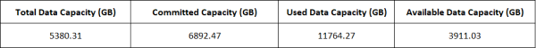
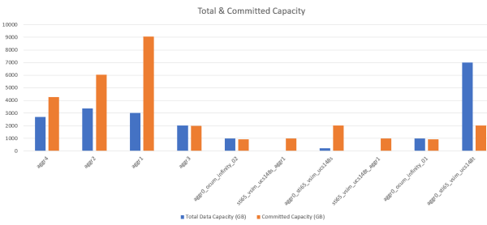

= Creating a report to show an aggregate capacity table and chart
:icons: font
:imagesdir: ../media/

[.lead]
You can create a report to analyze capacity in an Excel file by using summed totals and the clustered column chart format.

*What you'll need*

* You must have the Application Administrator or Storage Administrator role.

Use the following steps to open a Health: All Aggregates view, download the view in Excel, create an available capacity chart, upload the customized Excel file, and schedule the final report.

.Steps

. In the left navigation pane, click *Storage* > *Aggregates*.
. Select *Reports* > *Download Excel*.
+
image::../media/download_excel_menu.png[A UI screenshot that shows how to download excel from reports.]
+
Depending on your browser, you might need to click *OK* to save the file.

. If needed, click *Enable Editing*.
. In Excel, open the downloaded file.
. Create a new sheet () after the `data` sheet and name it *Total Data Capacity*.
. Add the following columns on the new Total Data Capacity sheet:
 .. Total Data Capacity (GB)
 .. Committed Capacity (GB)
 .. Used Data Capacity (GB)
 .. Available Data Capacity (GB)
. In the first row of each column, enter the following formula, making sure that it references the data sheet (data!), and references the correct column and row specifiers for the data captured (Total Data Capacity pulls data from column E, rows 2 through 20).
 .. =SUM(data!E$2:data!E$20)
 .. =SUM(data!F$2:data!F$50)
 .. =SUM(data!G$2:data!G$50)
 .. =SUM(data!H$2:data!H$50)

+
The formula totals each column based on the current data.

. On the data sheet, select the *Total Data Capacity (GB)* and *Committed Capacity (GB)* columns.
. Select *Recommended Charts* from the *Insert* menu and select the *Clustered Column* chart.
. Right-click the chart and select *Move chart* to move the chart to the `Total Data Capacity` sheet.
. Using the *Design* and *Format* menus, which are available when the chart is selected, you can customize how the chart looks.
. When satisfied, save the file with your changes. Do not change the file name or location.
+

. In Unified Manager, select *Reports* > *Upload Excel*.
+
[NOTE]
====
Make sure you are in the same view where you downloaded the Excel file.
====

. Select the Excel file you have modified.
. Click *Open*.
. Click *Submit*.
+
A check mark appears beside the *Reports* > *Upload Excel* menu item.
+
image::../media/upload_excel.png[A UI screenshot that shows how to upload excel to reports.]

. Click *Scheduled Reports*.
. Click *Add Schedule* to add a new row to the Report Schedules page so that you can define the schedule characteristics for the new report.
+
[NOTE]
====
Select the *XLSX* format for the report.
====

. Enter a name for the report schedule and complete the other report fields, then click the check mark (image:../media/blue_check.gif[]) at the end of the row.
+
The report is sent immediately as a test. After that, the report generates and is sent by email to the recipients listed using the specified frequency.

Based on the results shown in the report, you might want to investigate how to best use the available capacity across your network.
