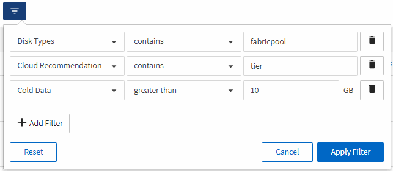
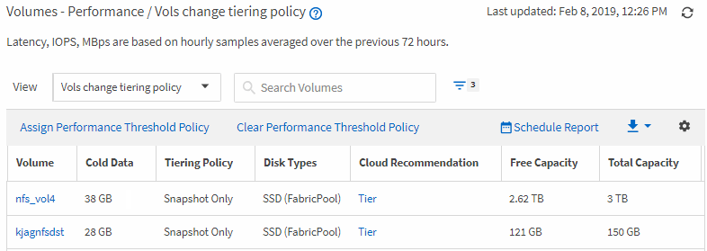

= Creating a report to identify volumes on FabricPool aggregates that should move data to the cloud tier
:icons: font
:imagesdir: ../media/

[.lead]
You can create a report that contains the list of volumes that currently reside on FabricPool aggregates, that have a cloud recommendation of Tier, and that have a large amount of cold data. This report can help you decide if you should change the tiering policy for certain volumes to "`auto`" or "`all`" to offload more cold (inactive) data to the cloud tier.

*What you'll need*

* You must have the Application Administrator or Storage Administrator role.
* You must have configured FabricPool aggregates and have volumes on those aggregates.

Follow the steps below to create a custom view that displays the required columns in the correct order, and then schedule a report to be generated for that view.

.Steps

. In the left navigation pane, click *Storage* > *Volumes*.
. In the View menu, select *Performance* > *All Volumes*.
. In the column chooser, make sure that the "`Disk Type`" column appears in the view.
+
Add or remove other columns to create a view that is important for your report.

. Drag and drop the "`Disk Type`" column near the "`Cloud Recommendation`" column.
. Click the filter icon, add the following three filters, and then click *Apply Filter*:
 ** Disk Type contains FabricPool
 ** Cloud Recommendation contains tier
 ** Cold Data greater than 10 GB

. Click the top of the Cold Data column so that the volumes with the most cold data appear at the top of the view.
. Save the view with a name to reflect what the view is showing, for example "`Vols change tiering policy`".
. Click the *Scheduled Reports* button on the inventory page.
. Click *Add Schedule* to add a new row to the Report Schedules page so that you can define the schedule characteristics for the new report.
. Enter a name for the report schedule and complete the other report fields, then click the check mark (image:../media/blue_check.gif[]) at the end of the row.
+
The report is sent immediately as a test. After that, the report generates and is sent by email to the recipients listed using the specified frequency.

Based on the results shown in the report, you might want to use System Manager or the ONTAP CLI to change the tiering policy to "`auto`" or "`all`" for certain volumes to offload more cold data to the cloud tier.
