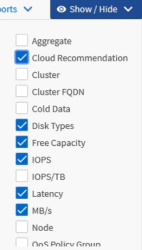

= Customizing columns
:icons: font
:imagesdir: ../media/

[.lead]
Use *Show/Hide* to choose the columns you want to use in your report. Drag the columns on the inventory page to rearrange them.

.Steps

. Click *Show/Hide* to add or remove columns.
+

. On the inventory page, drag columns to rearrange them in the order you want in your report.
. Name the unsaved view to save your changes.
