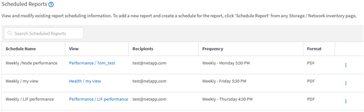

= Deleting scheduled reports
:icons: font
:imagesdir: ../media/

[.lead]
After reports are scheduled, you can delete them from the Report Schedules page.

*What you'll need*

* You must have the Application Administrator or Storage Administrator role.

.Steps

. In the left navigation pane, click *Storage Management* > *Report Schedules*.
+

+
[NOTE]
====
If you have the appropriate permissions you can remove any report and its schedule in the system.
====

. Click the more icon image:../media/more_icon.gif[""] for the schedule you want to remove.
. Click *Delete*.
. Confirm your decision.
+
The scheduled report is removed from the list and will no longer be generated and distributed on the set schedule.
+
[NOTE]
====
If you delete a custom view from the inventory page, any custom Excel files or scheduled reports that use that view are also deleted.
====
