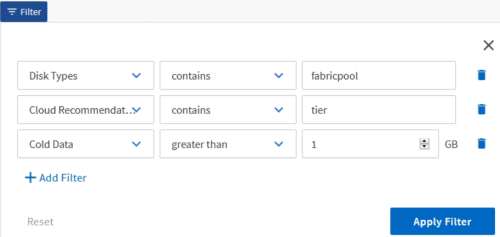
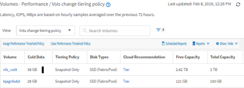
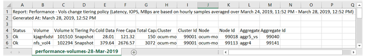
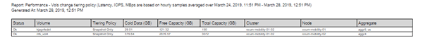

= Reporting quick start
:icons: font
:imagesdir: ../media/

[.lead]
Create a sample custom report to experience exploring views and scheduling reports. This quick start report finds a list of volumes that you might want to move to the cloud tier because there is a fair amount of inactive (cold) data. You will open the Performance: All Volumes view, customize the view using filters and columns, save the custom view as a report, and schedule the report to share once a week.

*What you'll need*

* You must have the Application Administrator or Storage Administrator role.
* You must have configured FabricPool aggregates and have volumes on those aggregates.

Follow the steps below to:

* Open the default view
* Customize the columns by filtering and sorting the data
* Save the view
* Schedule a report to be generated for the custom view

.Steps

. In the left navigation pane, click *Storage* > *Volumes*.
. In the View menu, select *Performance* > *All Volumes*.
. Click *Show/Hide* to make sure the "`Disk Types`" column appears in the view.
+
image::../media/show_hide_3.png[A UI screenshot that shows the drop down list of Show/Hide menu.]
+
Add or remove other columns to create a view that contains the fields that are important for your report.

. Drag the "`Disk Types`" column next to the "`Cloud Recommendation`" column.
. Click the filter icon to add the following three filters, and then click *Apply Filter*:
 ** Disk Types contains FabricPool
 ** Cloud Recommendation contains tier
 ** Cold Data greater than 10 GB

+
Note that each filter is joined with a logical AND so that all volumes returned must meet all the criteria. You can add a maximum of five filters.
. Click the top of the Cold Data column to sort the results so that the volumes with the most cold data appear at the top of the view.
. When the view is customized, the view name is Unsaved View. Name the view to reflect what the view is showing, for example "`Vols change tiering policy`". When done, click the check mark or press *Enter* to save the view with the new name.
+

. Download the report as a *CSV*, *Excel*, or *PDF* file to see the output before you schedule or share it.
+
Open the file with an installed application, such as Microsoft Excel (CSV or Excel) or Adobe Acrobat (PDF), or save the file.
+
[NOTE]
====
You can further customize your report using complex filters, sorts, pivot tables, or charts by downloading the view as an Excel file. After you open the file in Excel, use the advanced features to customize your report. When satisfied, upload the Excel file. This file, with its customizations, is applied to the view when the report is run.
====
+
For more information on customizing reports using Excel, see _Sample Microsoft Excel reports_.

. Click the *Scheduled Reports* button on the inventory page. All scheduled reports relating to the object, in this case volumes, appear in the list.
+
image::../media/scheduled_reports_3.gif[A UI screenshot that shows all the scheduled reports related to the object.]

. Click *Add Schedule* to add a new row to the Report Schedules page so you can define the schedule characteristics for the new report.
. Enter a name for the report and complete the other report fields, then click the check mark (image:../media/blue_check.gif[]) at the end of the row.
+
The report is sent immediately as a test. After that, the report generates and is sent by email to the recipients listed using the specified frequency.
+
The following sample report is in CSV format:
+

+
The following sample report is in PDF format:
+

Based on the results shown in the report, you might want to use ONTAP System Manager or the ONTAP CLI to change the tiering policy to "`auto`" or "`all`" for certain volumes to offload more cold data to the cloud tier.
