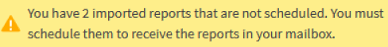
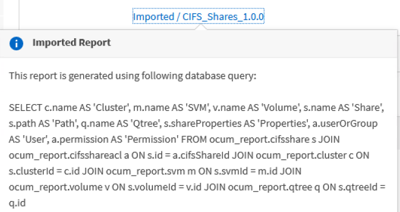

= Scheduling imported .rptdesign reports
:icons: font
:imagesdir: ../media/

[.lead]
You can schedule existing reports that were created and imported in an earlier release of Unified Manager.

Scheduling imported reports requires the following:

* imported BIRT designed .rptdesign file reports in an earlier Unified Manager release
* applicable when upgrading to Unified Manager 9.6 GA or later

After upgrading to Unified Manager 9.6 GA or later, the Report Schedules page lists the imported reports. You can edit the schedule for these reports to specify the recipient email addresses, frequency, and format (PDF or CSV). Otherwise these reports cannot be edited or viewed in the Unified Manager UI.

.Steps

. Open the Report Schedules page. If you have imported reports, a message appears.
+

. Click the *View* name to display the SQL query that is being used to generate the report.
+

. Click the more icon image:../media/more_icon.gif[], click *Edit*, define the report schedule details, and save the report.
+
[NOTE]
====
You can also delete any unwanted reports from the more icon image:../media/more_icon.gif[].
====
