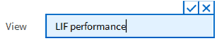
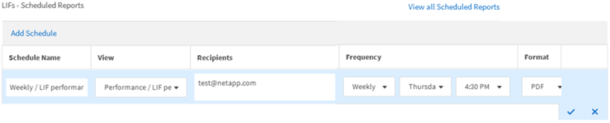

= Scheduling a report
:icons: font
:imagesdir: ../media/

[.lead]
After you have a view or Excel file that you want to schedule for regular generation and distribution, you can schedule the report.

*What you'll need*

* You must have the Application Administrator or Storage Administrator role.
* You must have configured the SMTP server settings in the *General* > *Notifications* page so that the reporting engine can send reports as email attachments to the list of recipients from the Unified Manager server.
* The email server must be configured to allow attachments to be sent with the generated emails.

Use the following steps to test and schedule a report to be generated for a view. Select or customize the view you want to use. The following procedure uses a network view that shows the performance of your network interfaces, but you can use any view you want.

.Steps

. Open your view. This example uses the default network view that shows LIF performance. In the left navigation pane, click *Network > Network Interfaces*.
. Customize the view as needed using the built-in Unified Manager features.
. After you customized the view, you can provide a unique name in the *View* field and click the check mark to save it.
+

. You can use the advanced features of Microsoft® Excel to customize your report. For details, see link:task_use_excel_to_customize_your_report.html[Using Excel to customize your report].
. To see the output before you schedule or share it:
+
[cols="2*",options="header"]
|===
a| Option| Description
a|
*If you used Excel to customize the report*
a|
View the existing downloaded Excel file.
a|
*If you did not use Excel to customize the report*
a|
Download the report as a *CSV*, *PDF* or *XLSX* file.
|===
Open the file with an installed application, such as Microsoft Excel (CSV/XSLX) or Adobe Acrobat (PDF).

. If you are satisfied with the report, click *Scheduled Reports*.
. In the Report Schedules page, click *Add Schedule*.
. Accept the default name, which is a combination of the view name and the frequency, or customize the *schedule name*.
. To test the scheduled report the first time, only add yourself as the *recipient*. When satisfied, add the email addresses for all report recipients.
. Specify how frequently the report will be generated and sent to the recipients. You can choose *Daily*, *Weekly*, or *Monthly*.
. Select the format, either *PDF*, *CSV*, or *XSLX*.
+
[NOTE]
====
For reports where you used Excel to customize the content, always select *XSLX*.
====

. Click the checkmark (image:../media/blue_check.gif[]) to save the report schedule.
+

+
The report is sent immediately as a test. After that, the report generates and is sent by email to the recipients listed using the scheduled frequency.
