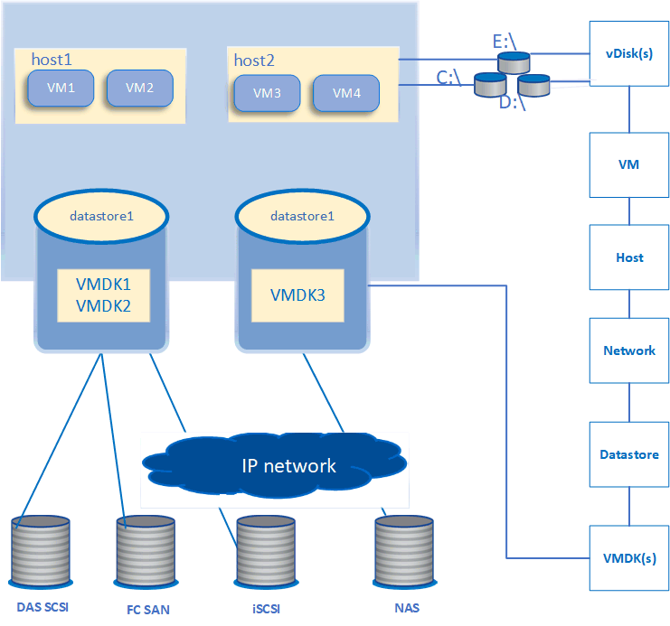
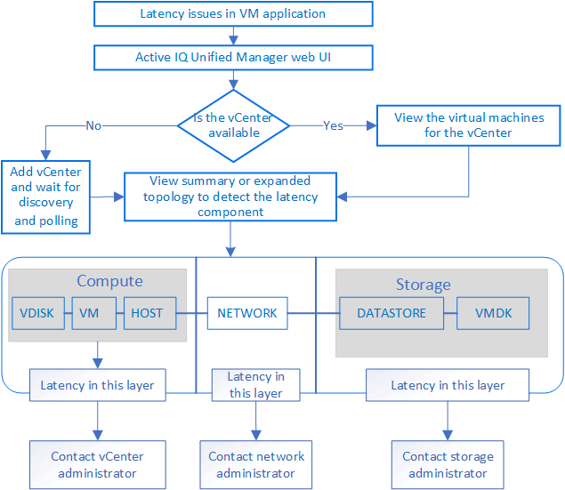

= Monitoring VMware virtual infrastructure
:icons: font
:imagesdir: ../media/

[.lead]
Active IQ Unified Manager provides visibility into the virtual machines (VMs) in your virtual infrastructure, and enables monitoring and troubleshooting storage and performance issues in your virtual environment. You can use this feature to determine any latency issues in your storage environment or when there is a reported performance event on your vCenter Server.

A typical virtual infrastructure deployment on ONTAP has various components that are spread across compute, network, and storage layers. Any performance lag in a VM application might occur due to a combination of latencies faced by the various components at the respective layers. This feature is useful for storage and vCenter Server admins and IT generalists who need to analyze a performance issue in a virtual environment and understand in which component the issue has occurred.

You can now access the vCenter Server from the vCenter menu of the VMware section. The peek view of each virtual machine listed has the *VCENTER SERVER* link in the TOPOLOGY VIEW that launches the vCenter Server in a new browser. You can also use the *Expand Topology* button to launch the vCenter Server and click *View in vCenter* button to view the datastores in vCenter Server.

Unified Manager presents the underlying sub-system of a virtual environment in a topological view for determining whether a latency issue has occurred in the compute node, network, or storage. The view also highlights the specific object that causes the performance lag for taking remedial steps and addressing the underlying issue.

A virtual infrastructure deployed on ONTAP storage includes the following objects:

* vCenter Server: A centralized control plane for managing the VMware VMs, ESXi hosts, and all related components in a virtual environment. For more information about vCenter Server, see VMware documentation.
* Host: A physical or virtual system that runs ESXi, the virtualization software from VMware, and hosts the VM.
* Datastore: Datastores are virtual storage objects that are connected to the ESXi hosts. Datastores are manageable storage entities of ONTAP, such as LUNs or volumes, used as a repository for VM files, such as log files, scripts, configuration files, and virtual disks. They are connected to the hosts in the environment via a SAN or IP network connection. Datastores outside of ONTAP that are mapped to vCenter Server are not supported or displayed on Unified Manager.
* VM: A VMware virtual machine.
* Virtual disks: The virtual disks on datastores belonging to the VMs that have an extension as VMDK. Data from a virtual disk is stored on the corresponding VMDK.
* VMDK: A virtual machine disk on the datastore that provides storage space for virtual disks. For each virtual disk, there is a corresponding VMDK.

These objects are represented in a VM topology view.

*VMware virtualization on ONTAP*

*User workflow*

The following diagram displays a typical use case of using the VM topology view:

== What is not supported

* Datastores that are outside of ONTAP and are mapped to the vCenter Server instances are not supported on Unified Manager. Any VMs with virtual disks on those datastores are also not supported.
* A datastore that spans across multiple LUNs is not supported.
* Datastores using Network address translation (NAT) for mapping data LIF (access endpoint) are not supported.
* Exporting volumes or LUNs as datastores on different clusters with same IP addresses in a multiple-LIFs configuration is not supported as Unified Manager is unable to identify which datastore belongs to which cluster.
+
Example: Suppose cluster A has datastore A. Datastore A is exported via data LIF with same IP address x.x.x.x and VM A is created on this datastore. Similarly, cluster B has datastore B. The datastore B is exported via data LIF with same IP address x.x.x.x and VM B is created on the datastore B. UM will neither be able to map the datastore A for VM A's topology to corresponding ONTAP volume/LUN nor map VM B.

* Only NAS and SAN volumes (iSCSI and FCP for VMFS) are supported as datastores, virtual volumes (vVols) are not supported.
* Only iSCSI virtual disks are supported. Virtual disks of NVMe and SATA types are not supported.
* The views do not allow you to generate reports for analysing the performance of the various components.
* For the storage virtual machine (storage VM) disaster recovery (DR) setup that is supported for only virtual infrastructure on Unified Manager, the configuration has to be manually changed in vCenter Server to point to the active LUNs in switchover and switchback scenarios. Without a manual intervention, their datastores become inaccessible.
