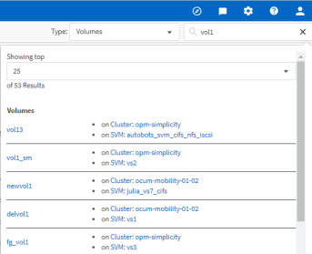

= Searching for storage objects
:icons: font
:imagesdir: ../media/

[.lead]
To quickly access a specific object, you can use the *Search all Storage Objects* field at the top of the menu bar. This method of global search across all objects enables you to quickly locate specific objects by type. Search results are sorted by storage object type and you can filter them further by object using the drop-down menu.

*What you'll need*

* You must have one of the following roles to perform this task: Operator, Application Administrator, or Storage Administrator.
* A valid search must contain at least three characters.

When using the drop-down menu value "All", the global search displays the total number of results found in all object categories; with a maximum of 25 search results for each object category. You can select a specific object type from the drop-down menu to refine the search within a specific object type. In this case the returned list is not restricted to the top 25 objects.

The object types you can search for include:

* Clusters
* Nodes
* Storage VMs
* Aggregates
* Volumes
* Qtrees
* SMB Shares
* NFS Shares
* User or Group Quotas
* LUNs
* NVMe Namespaces
* Initiator Groups
* Initiators
* Consistency Group

Entering a workload name returns the list of workloads under the appropriate Volumes or LUNs category.

You can click any object in the search results to navigate to the Health details page for that object. If there is no direct health page for an object, then the Health page of the parent object is displayed. For example, when searching for a specific LUN, the SVM details page on which the LUN resides is displayed.

[NOTE]
====
Ports and LIFs are not searchable in the global search bar.
====
.Steps

. Select an object type from the menu to refine the search results for only a single object type.
. Type a minimum of three characters of the object name in the *Search all Storage Objects* field.
+
In this example, the drop-down box has the Volumes object type selected. Typing "vol1" into the *Search all Storage Objects* field displays a list of all volumes whose names contain these characters.
+

